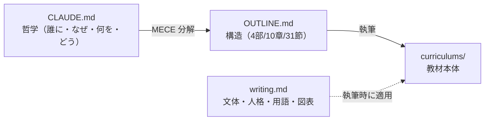

# Laravel 実践ステップアップ講座

2026年2月以前の教材で Laravel を学び、ひととおり CRUD アプリを作れるようになった方が、**2026年3月以降の教材と同じ技術レベル**に到達し、新しい模擬案件に対応できるようになるための教材です。すでに学んだ内容は省き、**新しく必要になる実践技術**（公開 API・認可・自動テスト・多対多リレーション・集計・Laravel Sail）に集中します。

> 本リポジトリは、教材本体（`curriculums/`）と、それを Claude Code のスキルで設計・執筆・保守するためのワークフロー一式です。教材の設計思想は [`CLAUDE.md`](./CLAUDE.md)、カリキュラム設計は [`OUTLINE.md`](./OUTLINE.md)、執筆ルールは [`.claude/rules/writing.md`](./.claude/rules/writing.md) を参照してください。

## 学べること

| テーマ | 内容 |
|---|---|
| 公開 REST API | ルート設計（apiResource・バージョニング）、API Resource、検索・ページネーション、JSON 例外・ステータス制御 |
| 認可（Policy） | Gate と Policy、所有者ベースのアクセス制御 |
| 多対多リレーション | ピボットテーブル設計、`belongsToMany`、`attach`/`sync`/`toggle` |
| 集計とパフォーマンス | `withCount`/`withAvg` による集計・ランキング、`with`/`load` と N+1 回避 |
| 自動テスト | PHPUnit の Feature/Unit テスト、Factory・RefreshDatabase、JSON/DB アサーション |
| 開発環境 | Laravel Sail（Docker）、Laravel 8 → 10 の変更点、PHP OOP の基礎 |

## 技術スタック

- Laravel 10.x / PHP 8.1+
- Laravel Sail（Docker）+ MySQL 8
- Laravel Fortify（認証）/ PHPUnit 10（テスト）/ Tailwind CSS + Vite（フロント）
- ハンズオン題材: タスク管理アプリ（スターターキット `coachtech-material/laravel-api-starter` 等を流用）

## 教材の構成

3層（Part > Chapter > Section）/ 全 **4 部・10 章・31 節**。想定学習時間は約 **40〜50 時間**。

| Part | テーマ |
|---|---|
| Part 1 | 前提と開発環境を整える（差分の地図・PHP OOP・Sail・Laravel 8→10） |
| Part 2 | Laravel の新概念（多対多・認可 Policy・集計・自動テスト） |
| Part 3 | 公開 REST API（ルート設計・Resource・検索/ページネーション・エラー設計） |
| Part 4 | 総合ハンズオン（タスク管理アプリをゼロから構築し、学んだ技術を統合） |

各 Section のゴール・種類・依存関係は [`OUTLINE.md`](./OUTLINE.md) を参照。概念 Section を主軸に、各技術を **Why → What → How** の順で解説し、認可・API は章末ハンズオン（スターターキット）で実践、最後の総合ハンズオンでゼロからアプリを構築して統合します。

## リポジトリ構成

```
.
├── CLAUDE.md              # 教材の哲学（WHO/WHY/WHAT/HOW/MAP）
├── OUTLINE.md             # カリキュラム設計（4部/10章/31節）
├── curriculums/           # 教材本体（Part > Chapter > Section）
├── video/                 # Remotion による Section 解説動画プロジェクト
├── .claude/
│   ├── rules/writing.md   # 執筆ルール（文体・テンプレート・用語・図表）
│   ├── skills/            # 設計・執筆・レビュー等のスキル定義
│   └── settings.json
└── docs/                  # 設計根拠・解析資料（ローカル参照用・Git 管理外）
```

## 開発ワークフロー（Claude Code スキル）

本教材は Claude Code のスキルで設計・執筆・保守します。

| スキル | 役割 |
|---|---|
| `/setup` | 哲学定義 → 構造設計 → 執筆ルール調整（CLAUDE.md・OUTLINE.md・writing.md を生成） |
| `/write` | OUTLINE に基づいて Section を執筆 |
| `/review` | 品質・設計整合・正確性・実践フォロー可能性をレビュー |
| `/check-updates` | Laravel 公式ドキュメントとの鮮度チェック |
| `/illustrate` | Gemini で概念図を生成・挿入（各概念 Section に 1 枚。`GEMINI_API_KEY` が必要） |
| `/animate` | Remotion で Section 解説動画（アニメ＋ナレーション＋字幕）を生成・挿入 |
| `/github-pages` | MkDocs Material + GitHub Actions で GitHub Pages に公開 |

```bash
# 例: Chapter 1 を執筆
/write Chapter 1

# 例: Part 2 をレビュー
/review Part 2
```

設計の三層（哲学 → 構造 → 本体）は次の関係です。


