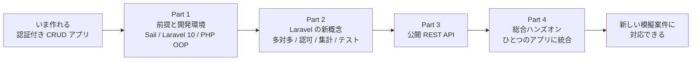

# 1-1 この教材の全体像と進め方

この教材は、2026年2月以前の教材で学習してきた方を対象に、2026年3月以降の教材と同じ技術レベルへ到達し、新しい模擬案件に対応できる状態になることを目的としています。すでに学んだ内容は前提とし、新しく必要になる技術に絞って解説します。

この Chapter では、まず教材全体の構成を把握し、続いて Laravel のコードを読み解くための PHP の基礎を固めます。

| セクション | テーマ | 種類 |
|---|---|---|
| 1-1 この教材の全体像と進め方 | 学習の全体像と到達点 | 概念 |
| 1-2 PHP OOP の基礎 | Laravel のクラスを読み解く OOP | 概念 |

📖 **この Chapter の進め方**: 1-1 で、すでに身についている内容とこれから学ぶ内容を整理し、学習の見通しを立てます。続く 1-2 で、以降のすべての Chapter で扱う Laravel のクラスを読み解くための PHP の文法を固めます。

## 🎯 このセクションで学ぶこと

- すでに身についている力（CRUD・FormRequest・認証・基本的な Eloquent・N+1 対策など）を整理する
- これから学ぶ技術（公開 API・認可・自動テスト・多対多の実践・集計・Laravel Sail）の全体像をつかむ
- 学習の順序と到達点、教材の進め方を理解する

このセクションでは、学習の出発点とこれから学ぶ技術、そして全体の構成を確認します。

---

## 導入: 「作れる」のに「何を学べばいいか」が見えない

あなたはすでに、認証付きの画面と DB を備えたアプリケーションを一通り作れます。ルーティング、コントローラ、Blade、マイグレーション、Eloquent での CRUD、FormRequest、N+1 対策まで経験済みです。

ところが、「公開 API を作って、テストも書いてください」のような課題では、どこから手をつければよいか迷いがちです。新しい模擬案件も、与えられた要件をもとにアプリを実装し、認証や CRUD に加えて、公開 API・認可・テストまでを備えることを求めます。できることは増えても、次に身につけるべき技術の見取り図がなければ、何から学べばよいかは見えてきません。このセクションでは、その見取り図として、現在地・学ぶ技術・到達点を順に示します。

### 🧠 先輩エンジニアの思考プロセス

> 私が新人のころ、まさに同じ壁にぶつかりました。社内ツールの CRUD なら一人で作れる。そこへ「外部に公開する JSON の API を、テスト付きで」というタスクが来て、途方に暮れたんです。
>
> 救われたのは、先輩に「埋めるべきものは漠然とした実力不足じゃない。公開 API、認可、テスト、多対多、集計と、名前のつく技術の集まりだ」と整理してもらったときでした。一つずつ順番に学べると分かれば、あとは進めるだけです。

---

## すでに身についていること

次の内容はすでに経験済みのため、本教材では改めて解説せず、前提として扱います。

- ルーティング、コントローラ、Blade（継承・コンポーネントを含む）で画面付きのアプリを作る
- マイグレーションでテーブルを定義し、Eloquent で作成・取得・更新・削除（CRUD）を行う
- `hasMany` / `belongsTo` による 1 対多のリレーションを定義する
- FormRequest にバリデーションを切り出す
- Laravel Fortify による認証（登録・ログイン・ログアウト）を実装する
- N+1 問題を理解し、`with()` による Eager Loading で回避する
- Seeder と Factory でテストデータを用意する
- Git で branch・commit・push・pull request・merge を行う

これらを一人でこなせることが、本教材の出発点です。

## これから新しく学ぶこと

本教材で新しく身につけるのは、次の技術です。いずれも既習の知識の上に積み上げます。

| 新しく学ぶ技術 | 何ができるようになるか |
|---|---|
| 公開 REST API | 画面ではなく JSON を返す API を、ルート設計からレスポンス整形・検索・エラー処理まで設計・実装できる |
| 認可（Policy） | 「ログインしているか」だけでなく「この人がこの操作をしてよいか」を制御し、所有者だけが編集・削除できるようにする |
| 自動テスト（PHPUnit） | コードが期待どおり動くことをテストで保証し、壊れていないことを自動で確認できる |
| 多対多リレーションの実践 | ピボットテーブルを設計し、`belongsToMany` と `attach` / `sync` / `toggle` でタグ付けやお気に入りのような関係を扱える |
| 集計とパフォーマンス | 関連レコードの件数や平均を集計してランキングを作り、`with` と `load` を使い分けて N+1 を避ける |
| Laravel Sail と Laravel 10 | Docker をシンプルに扱う Sail で環境を整え、Laravel 8 から 10 への変化を踏まえて実装する |

加えて、あいまいさを含む要件を読み解き、ER 図やテーブル設計に落とし込む力も、Part 4 の総合的な実践で扱います。

これらは独立した知識ではなく、ひとつのアプリの中で組み合わさって働きます。たとえば公開 API には認可とテストが関わり、集計には多対多やリレーションの知識が関わります。一つずつ理解したうえで、最後にそれらを組み合わせて使えるようにするのが、この教材の流れです。

## 学習の順序と到達点

これらは積み上がる順に、4 つの Part に並べています。

- **Part 1（いまここ）**: 開発環境を Laravel Sail に移し、Laravel 8 から 10 への変化を押さえ、Laravel のコードを読み解くための PHP の基礎を固めます。
- **Part 2**: 多対多の実践・認可・集計・自動テストという、モデル層から検証までの新しい概念を学びます。
- **Part 3**: 未経験の公開 REST API を、設計から実装まで扱います。
- **Part 4**: タスク管理アプリをゼロから組み上げ、Part 1 から 3 の技術を統合します。

前の Part が次の Part の土台になる構成です。Part 1 で整えた Sail 環境とクラスの読み方がそれ以降のすべての前提になり、Part 2 で学ぶ認可・多対多・集計は、Part 3 の公開 API と Part 4 の統合実装でそのまま使います。

Part 4 を終えるころには、要件を読み解いて設計し、認可付きの CRUD と公開 API を実装し、テストで品質を保証する一連を、自分の手で通せるようになります。

## 教材の進め方

進めるうえで、次の 3 点を押さえておいてください。

🔑 **概念の理解** を主役にします。各技術を「なぜ必要か → 何か → どう使うか」の順で解説します。構文の暗記より、仕組みの理解を優先してください。

🔑 要所に **手を動かす場面** を置きます。Part 1 末尾のサンドボックス、章末ハンズオン、総合ハンズオンで、学んだ概念を実際に試します。

💡 すでに身についている内容は省いています。CRUD やルーティングの基本は改めて解説しません。「知っている」と感じる箇所が少ないのは、現在地に合わせて内容を絞っているためです。

---

## ✨ まとめ

- 認証付きの CRUD アプリを作れることが、学習の出発点
- これから学ぶのは、公開 API・認可・自動テスト・多対多の実践・集計・Laravel Sail と Laravel 10
- 全体は 4 つの Part で構成され、環境づくり、新概念、公開 API、総合的な統合へと進む
- 概念の理解を主役にし、要所で手を動かして定着させる

---

次のセクションでは、この先で扱う Laravel のクラス群、つまりコントローラ・モデル・FormRequest・Policy・Resource を読み解くための PHP OOP の基礎を固めます。クラスとインスタンスの違い、プロパティとメソッド、コンストラクタ、型宣言、継承（`extends`）、名前空間と `use`、そして `$this` が何を指すのかを確認し、Laravel のコードがクラスとしてどう書かれているのかを読めるようにします。
