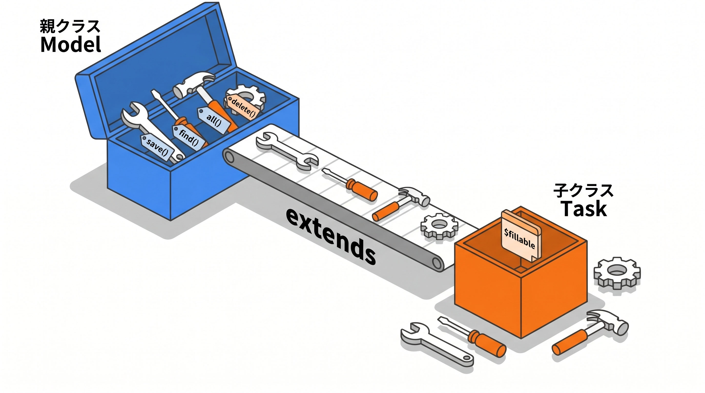
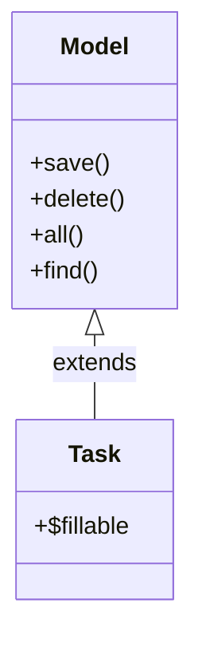

# 1-2 PHP OOP の基礎

📝 **前提知識**: このセクションは 1-1 この教材の全体像と進め方 の内容を前提としています。

## 🎯 このセクションで学ぶこと

- クラスとインスタンスの違い、プロパティとメソッド、コンストラクタ、`$this` が何を指すかを理解する
- 型宣言、継承（`extends`）、名前空間と `use` を理解し、Laravel のコードがなぜそう書かれているのかを読み解く
- コントローラ・モデル・FormRequest・Policy・Resource という Laravel のクラス群を、構造として読めるようになる

このセクションでは、これまで「お作法」として書いてきた Laravel のコードを、PHP の文法という視点から読み解けるようにします。

---

## 導入: 動くけれど、仕組みは説明できない

これまで Laravel でアプリを作るとき、`class TaskController extends Controller` と書き、その中に `public function store(...)` を並べ、`$this->validate(...)` を呼んできました。動くものは作れた。けれど、`extends` とは何を意味するのか、`$this` は誰を指しているのか、なぜ自分で定義していない `validate()` を呼べるのかと問われると、はっきり答えられないかもしれません。

それでも CRUD は作れてしまいます。テンプレートをまねて埋めれば動くからです。しかしこの先で扱う Policy や API Resource は、クラスの仕組みを理解していないと「どこに何を書けばよいか」の勘所がつかめません。ここで一度、Laravel のコードを支えている PHP のオブジェクト指向（OOP）の文法を、きちんと言葉にしておきます。

### 🧠 先輩エンジニアの思考プロセス

> 私も最初の半年は、クラスの仕組みを分からないまま乗り切っていました。`extends Model` の意味も知らず、`$this->title` と書けばデータが取れる、くらいの感覚で。
>
> 変わったのは、ほぼ空の `class Task extends Model` がなぜ `Task::all()` も `$task->save()` も動くのか調べたときです。答えは `extends` の一語、親の機能を受け継いでいただけでした。それが腑に落ちてから、Laravel のコードが急に読めるようになりました。



---

## クラスとインスタンス

**クラス** は「設計図」、**インスタンス** はその設計図から作られた「実体」です。クラスは一度書けば、そこから実体をいくつでも作れます。

説明のために、Laravel に依存しない最小のクラスを見てみます。

```php
// Task.php（説明のための最小クラス）
class Task
{
    public string $title;
    public bool $done = false;

    public function complete(): void
    {
        $this->done = true;
    }
}
```

この `Task` がクラス（設計図）です。ここから実体を作るには `new` を使います。

```php
// new でインスタンス（実体）を作る
$task = new Task();
$task->title = '買い物';
$task->complete();
```

`new Task()` で作られた `$task` がインスタンスです。`$task->title` のように、インスタンスに対して中身を読み書きします。設計図は 1 つでも、`new` するたびに別々の実体が生まれ、それぞれが自分の `title` や `done` を持ちます。

🔑 Laravel では、`$task = Task::find(1)` で取り出した `$task` も `Task` クラスのインスタンスです。`App\Models\Task` というクラス（設計図）から作られた、1 件分のデータという実体だと考えてください。

## プロパティとメソッド

クラスの中身は、大きく 2 種類です。

- **プロパティ**: クラスが持つ「データ」。上の例の `$title` や `$done`
- **メソッド**: クラスが持つ「ふるまい（関数）」。上の例の `complete()`

あなたが Eloquent で `$task->title` と書くときの `title` はプロパティ、`$task->save()` と書くときの `save()` はメソッドです。プロパティはデータ、メソッドは動作、と区別して読むと、コードの意図が見えてきます。

## `$this` が指すもの

メソッドの中に出てくる `$this` は、**そのメソッドが今まさに呼ばれているインスタンス自身** を指します。

先ほどの `complete()` の中の `$this->done = true;` は、「このメソッドを呼んだインスタンスの `done` プロパティを `true` にする」という意味です。`$task->complete()` と呼べば `$this` は `$task` を指し、別の `$other->complete()` と呼べば `$this` は `$other` を指します。

🔑 コントローラの中で `$this->validate(...)` や `$this->authorize(...)` と書けるのも、`$this` がそのコントローラのインスタンスを指し、そのインスタンスが（継承によって）`validate()` や `authorize()` というメソッドを持っているからです。

## コンストラクタ

**コンストラクタ** は、`new` でインスタンスが作られる瞬間に自動で呼ばれる特別なメソッドで、名前は `__construct` です。インスタンスの初期設定に使います。

```php
// Task.php（説明のための最小クラス）
class Task
{
    public function __construct(public string $title, public bool $done = false)
    {
    }
}

$task = new Task('買い物');
```

`new Task('買い物')` の引数が、そのまま `__construct` に渡されます。Laravel では、コンストラクタは依存するオブジェクトを受け取る場所としてよく使われます（依存性の注入）。いまは「`new` のときに一度だけ走る初期化のメソッド」と理解しておけば十分です。

## 型宣言

PHP では、メソッドの引数や戻り値、プロパティに「型」を宣言できます。型を宣言しておくと、想定外の値が入ったときにエラーで気づけます。

```php
// app/Http/Controllers/TaskController.php
public function store(StoreTaskRequest $request): RedirectResponse
{
    // ...
}
```

- 引数の `StoreTaskRequest $request` は、「`$request` には `StoreTaskRequest` 型のインスタンスが入る」という宣言
- 末尾の `: RedirectResponse` は、「このメソッドは `RedirectResponse` 型を返す」という戻り値の型宣言

💡 後で学ぶように、Laravel 10 では、生成されるコントローラやモデルにこうした型宣言が最初から付くようになりました（この変化は次の Chapter で扱います）。型は読み手への案内表示でもあります。引数の型を見れば「ここには何が渡ってくるのか」が一目で分かります。

## 継承（`extends`）

**継承** は、あるクラス（親）の機能を、別のクラス（子）が受け継ぐ仕組みです。`class 子 extends 親` と書きます。

これが、導入で触れた「空っぽのモデルが動く理由」です。

```php
// app/Models/Task.php
namespace App\Models;

use Illuminate\Database\Eloquent\Model;

class Task extends Model
{
    protected $fillable = ['title', 'done'];
}
```



`Task` 自身には `save()` も `find()` も書かれていません。それでも使えるのは、`extends Model` によって `Illuminate\Database\Eloquent\Model`（親）の機能をまるごと受け継いでいるからです。あなたが書くのは、このモデル固有の設定（`$fillable` など）だけで済みます。

🔑 Laravel のクラスは、ほとんどがこの継承の上に成り立っています。`extends` の右側を見れば、「このクラスがどんな機能を親から受け継いでいるか」が分かります。コントローラなら `extends Controller`、FormRequest なら `extends FormRequest`、API Resource なら `extends JsonResource`。右側が、そのクラスの「正体」を教えてくれます。

## 名前空間と `use`

大きなアプリでは、同じ名前のクラスが別々の場所に存在しえます。それらを区別するのが **名前空間** です。ファイルの先頭の `namespace App\Models;` は、「このクラスは `App\Models` という名前空間に属する」という宣言です。

別の名前空間のクラスを使いたいときは、`use` でそのクラスのフルネーム（名前空間付きの名前）を取り込みます。

```php
// app/Http/Controllers/TaskController.php
namespace App\Http\Controllers;

use App\Models\Task;

class TaskController extends Controller
{
    public function show(Task $task)
    {
        return view('tasks.show', ['task' => $task]);
    }
}
```

ここでは `use App\Models\Task;` を書いたことで、以降は `Task` という短い名前で `App\Models\Task` を指せます。

📝 Laravel のクラスは、名前空間とディレクトリ構造が対応しています（PSR-4 という規約）。`App\Models\Task` は `app/Models/Task.php` に、`App\Http\Controllers\TaskController` は `app/Http/Controllers/TaskController.php` にあります。名前空間を見れば、ファイルの場所がたどれるということです。

## Laravel のクラス群を構造として読む

ここまでの文法を手に、この先で扱う Laravel のクラス群を見渡してみます。どれも「`extends 親` で機能を受け継ぎ、固有の設定とメソッドを足したクラス」という同じ形をしています。

| クラス | 典型的な宣言 | 役割 |
|---|---|---|
| コントローラ | `class TaskController extends Controller` | リクエストを受け取り処理を組み立てる |
| モデル | `class Task extends Model` | テーブル 1 行を表し、データを読み書きする |
| FormRequest | `class StoreTaskRequest extends FormRequest` | バリデーションのルールを切り出す |
| Policy | `class TaskPolicy` | 「この人がこの操作をしてよいか」を判定する |
| Resource | `class TaskResource extends JsonResource` | モデルを API のレスポンス形式に整える |

それぞれの中身は後続の Chapter で詳しく扱いますが、読み方の軸はもう手に入っています。`extends` の右側で親（＝受け継ぐ機能）を確認し、プロパティで設定を読み、メソッドでふるまいを読む。`$this` が出てきたら、それはこのクラスのインスタンス自身を指す。この見方を持てば、Laravel のコードは構造のあるものとして読めるようになります。

---

## ✨ まとめ

- クラスは設計図、インスタンスは `new` で作られる実体。プロパティはデータ、メソッドはふるまい
- `$this` はそのメソッドを呼んでいるインスタンス自身を指す
- コンストラクタ（`__construct`）は `new` の瞬間に走る初期化のメソッド
- 型宣言は引数・戻り値・プロパティに型を与え、コードの意図を明示する
- `extends`（継承）で親クラスの機能を受け継ぐ。Laravel のクラスが少ない記述で動くのはこのため
- 名前空間と `use` でクラスを区別・取り込みし、PSR-4 によって名前空間とファイルの場所が対応する

---

次のセクションからは、開発環境を整えます。まずは Laravel Sail の役割を、これまで使ってきた手書きの Docker Compose との違いから理解し、`sail up` でコンテナを起動し、`sail artisan` や `sail composer`、`sail npm` といったコマンドを Sail 越しに実行する流れをつかみます。あわせて、phpMyAdmin の追加と日本語ロケール設定の流れも見ていきます。
