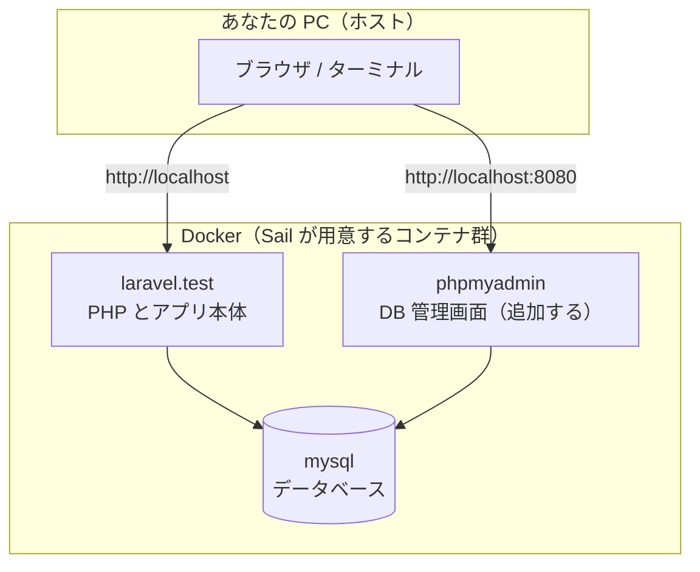

# 2-1 Laravel Sail で環境構築する

この Chapter では、開発環境を Laravel Sail に移し、Laravel 8 から 10 への変化を押さえたうえで、以降の実践で使うサンドボックスを用意します。

| セクション | テーマ | 種類 |
|---|---|---|
| 2-1 Laravel Sail で環境構築する | Sail の役割とコマンド | 概念 |
| 2-2 Laravel 8 から 10 への変更点 | 既習の知識を 10 で使い直す | 概念 |
| 2-3 ハンズオン: Laravel Sail プロジェクトを立ち上げる | サンドボックス構築 | ハンズオン |

📖 **この Chapter の進め方**: まず 2-1 で Laravel Sail が何をしてくれるのかを理解し、2-2 で Laravel 10 が 8 とどう違うのかを押さえます。最後に 2-3 で、実際に Sail で Laravel 10 のプロジェクトを立ち上げ、この先のセクションで使う実験用のサンドボックスを作ります。

📝 **前提知識**: このセクションは 1-1 この教材の全体像と進め方 の内容を前提としています。

## 🎯 このセクションで学ぶこと

- Laravel Sail の役割を、これまでの手書きの Docker Compose と比べて理解する
- `sail up`・`sail artisan`・`sail composer`・`sail npm` など、Sail 越しにコマンドを実行する流れをつかむ
- phpMyAdmin の追加と日本語ロケール設定の全体像を把握する

このセクションでは、Sail が「Docker をシンプルに扱うための道具」であることを理解し、その基本的な使い方を見ていきます。

💡 このセクションのコマンドは、Sail の使い方を理解するための例です。ここで手を動かす必要はありません。実際に環境を立ち上げるのは、次の 2-3 のハンズオンです。

---

## 導入: 環境構築で消える時間

これまで手書きの `docker-compose.yml`（または `compose.yaml`）で開発環境を組んできた方も多いはずです。nginx・PHP・MySQL のサービスを自分で定義し、ポートを開け、ボリュームをつなぎ、ときには Dockerfile も書く。最初に組み上げるまでが大変で、設定を少し間違えるだけでコンテナが起動しないこともあります。

環境構築そのものは本来の目的ではありません。短時間で、誰の手元でも同じように動く環境を用意する。それが Laravel Sail の役割です。

### 🧠 先輩エンジニアの思考プロセス

> 手書きの Compose は、最初の一個を作るときが一番つらいんです。前のプロジェクトの設定をコピーしてきて、PHP のバージョンを上げて、MySQL の認証まわりでハマって半日、というのを何度も繰り返していました。
>
> Sail はその最初のつらさをほぼ消してくれます。コマンドひとつで公式の構成が手に入り、それでいて中身は普通の `compose.yaml`。必要なら自分で手を入れられます。手書きを経験したあなたなら、Sail が裏で何をしているかも見えるはずです。


---

## Laravel Sail とは

Laravel Sail は、Laravel の標準的な Docker 開発環境を、シンプルなコマンドで操作するための **軽量な CLI** です。`laravel/sail` という開発用パッケージとして提供されます。

手書きの Docker Compose と、やっていること自体は同じです。違いは「誰が設定を用意するか」です。

| | 手書きの Docker Compose | Laravel Sail |
|---|---|---|
| 構成ファイル | 自分でゼロから書く | Laravel 公式が用意した `compose.yaml` を使う |
| PHP・MySQL などの構成 | 自分で組み合わせる | あらかじめ動作確認された組み合わせが手に入る |
| 操作 | `docker compose run ...` などを手で打つ | `sail artisan ...` のように短いコマンドで実行 |
| カスタマイズ | 自由（その代わり全部自分） | 生成された `compose.yaml` を編集すればよい |

🔑 中身は、見慣れた `compose.yaml` です。Sail を導入するとこの `compose.yaml` がプロジェクト直下に生成され、`sail` コマンドがその Compose 環境への薄いラッパー（呼び出し口）として働きます。

## `compose.yaml` と `sail` コマンド

Sail を導入すると、プロジェクト直下に `compose.yaml` が生成されます。ここに、アプリ本体のコンテナ（`laravel.test`）や MySQL のコンテナといったサービスが定義されます。下の図は、Sail が用意するコンテナ群と、あなたの PC との関係を表したものです。



`sail` の本体は `vendor/bin/sail` にあります。毎回 `./vendor/bin/sail` と打つのは手間なので、短いエイリアスを設定しておきます。次の 1 行を `~/.zshrc`（bash の場合は `~/.bashrc`）に追記し、シェルを開き直してください。

```bash
# ~/.zshrc
alias sail='sh $([ -f sail ] && echo sail || echo vendor/bin/sail)'
```

これ以降、このエイリアスを設定した前提で `sail ...` と表記します。

## Sail 越しにコマンドを実行する

Sail の要点は、PHP も Composer も Node も MySQL も、**すべてコンテナの中で動かす** ことです。あなたの PC にこれらをインストールする必要はありません。各種のコマンドは `sail` を頭に付けて、コンテナの中で実行します。

まずはコンテナの起動と停止です。

```bash
# コンテナをバックグラウンドで起動する
sail up -d

# コンテナを停止する
sail stop
```

`-d` はバックグラウンド（detached）での起動を意味します。起動すると、ブラウザで `http://localhost` にアプリが表示されます。

よく使うコマンドは次のとおりです。いずれも、頭に `sail` を付けるだけで、コンテナ内のツールが呼び出されます。

| コマンド | 何をするか |
|---|---|
| `sail artisan <コマンド>` | コンテナ内で Artisan を実行（例: `sail artisan migrate`） |
| `sail composer <コマンド>` | コンテナ内で Composer を実行（例: `sail composer require ...`） |
| `sail npm <コマンド>` | コンテナ内で npm を実行（例: `sail npm run dev`） |
| `sail php <コマンド>` | コンテナ内で PHP を実行 |
| `sail tinker` | Tinker（対話シェル）を起動し、コードを試せる |
| `sail mysql` | MySQL コンテナの MySQL クライアントに接続する |
| `sail shell` | コンテナ内のシェル（Bash）に入る |

🔑 既習の `php artisan migrate` は、Sail では `sail artisan migrate` になります。「いつものコマンドの前に `sail` を付けると、コンテナの中で動く」と覚えておけば、ほとんどの操作はそのまま通じます。

## phpMyAdmin と日本語ロケールの全体像

開発を進めるうえで、もう 2 つ準備しておきたいものがあります。ここでは全体像だけ示し、実際の手順は次のハンズオンで行います。

📝 **phpMyAdmin の追加**: データベースの中身を画面で確認できる phpMyAdmin は、Sail が標準で選べるサービスには含まれていません。そのため、生成された `compose.yaml` に phpMyAdmin のサービスを自分で 1 ブロック追記します。手書きの Compose を経験したあなたには馴染みのある作業です。

📝 **日本語ロケールの設定**: エラーメッセージなどを日本語で表示するために、`config/app.php` のロケールを `ja` に設定し、必要に応じて `lang/ja` に言語ファイルを置きます。

> ⚠️ **注意**: Apple Silicon（M1 / M2 など）の Mac では、コンテナの起動時にプラットフォームに関するエラーが出ることがあります。その場合は `compose.yaml` の該当サービスに `platform: linux/amd64` を追記すると解決することがあります。

これらを含めた立ち上げの一連の流れは、2-3 のハンズオンで最初から順に実行します。

---

## ✨ まとめ

- Laravel Sail は、Laravel の標準的な Docker 環境をシンプルなコマンドで操作する軽量な CLI。中身は見慣れた `compose.yaml`
- `sail up -d` で起動し、`sail artisan`・`sail composer`・`sail npm`・`sail tinker` など、いつものコマンドの頭に `sail` を付けてコンテナ内で実行する
- PHP や MySQL をホストに入れる必要はなく、すべてコンテナの中で動く
- phpMyAdmin は `compose.yaml` に手動で追加し、日本語ロケールは `config/app.php` と `lang/ja` で設定する。具体的な手順は 2-3 で行う

---

次のセクションでは、2026年2月以前の教材で使ってきた Laravel 8 と、これから前提とする Laravel 10 の主な変更点を押さえます。PHP 8.1 以上への引き上げと、それにともなって目にする `match` や enum、`readonly` といった PHP 8 の構文、`make:migration` が生成する無名マイグレーションクラス（`return new class extends Migration`）、`lang/` ディレクトリがプロジェクトルートへ移動したこと、そして生成されるコードに付くようになったネイティブな型宣言。既習の知識を Laravel 10 で安全に使い直せるようにします。
