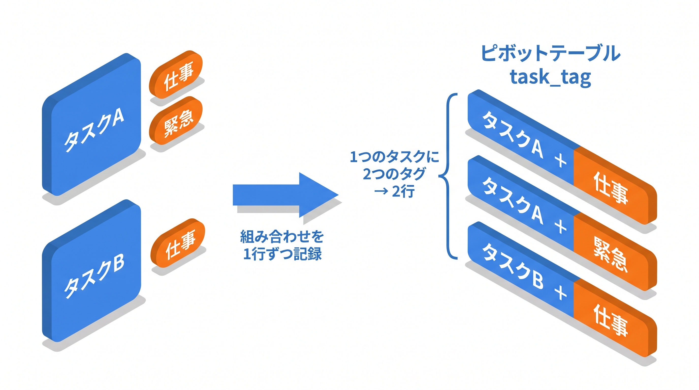
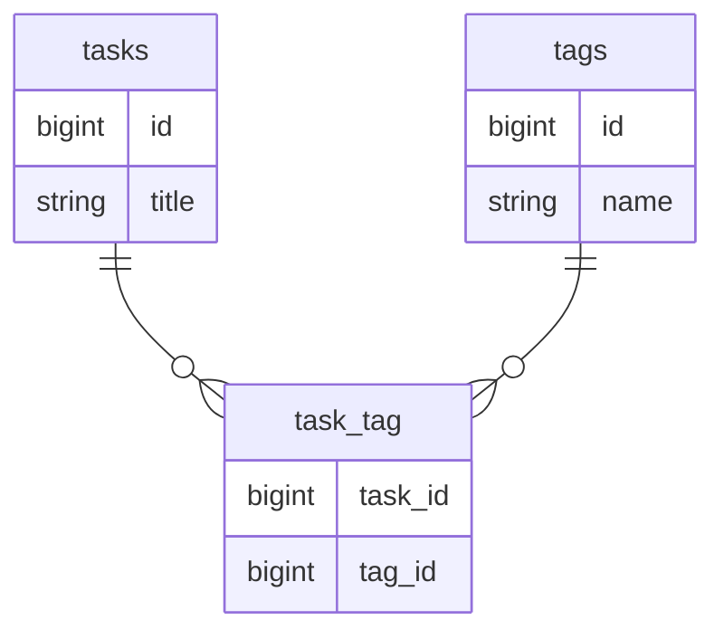

# 3-1 多対多とピボットテーブル

📝 **前提知識**: このセクションは 2-2 Laravel 8 から 10 への変更点 の内容を前提としています。

Chapter 3 では、多対多リレーションを扱います。「1 つのタスクに複数のタグ」「1 人のユーザーが複数のタスクをお気に入りに登録」といった、`hasMany` / `belongsTo` の 1 対多では表しきれない関係を、ピボットテーブルと `belongsToMany` で実装できるようにします。

| セクション | テーマ | 種類 |
|---|---|---|
| 3-1 多対多とピボットテーブル | 多対多の仕組みとピボットの設計 | 概念 |
| 3-2 ピボット操作（attach / detach / sync / toggle） | ピボットを操作する | 混合 |

📖 **この Chapter の進め方**: 3-1 で多対多の仕組みを理解し、2 パターンのピボットテーブルを設計して `belongsToMany` で関連を定義します。続く 3-2 で、その関連を操作するメソッドを、サンドボックスの Tinker で実際に動かして確認します。

## 🎯 このセクションで学ぶこと

- 1 対多では表せない関係を、なぜ中間テーブル（ピボットテーブル）で表すのかを理解する
- ピボットテーブルの 2 つのパターン（純粋なピボット／一意制約を持つピボット）を設計し、マイグレーションを書ける
- `belongsToMany` で多対多のリレーションを定義する（規約によるテーブル名と、明示的なテーブル指定）

このセクションでは、多対多の仕組みをテーブル設計から理解し、モデルに関連を定義するところまでを扱います。

💡 このセクションのマイグレーションやモデルのコードは、多対多の仕組みを理解するための例です。ここで手を動かす必要はありません。実際に書いて動かすのは、次の 3-2 と Part 4 の総合ハンズオンです。

---

## 導入: 1 対多では表せない関係がある

既習の `hasMany` / `belongsTo` は、「1 対多」を表します。1 つのカテゴリに複数のタスクが属し、1 つのタスクは 1 つのカテゴリに属する、という関係です。このとき、外部キー（`category_id`）はタスク側に 1 つ持たせれば足ります。

ところが、タスクに「タグ」を付ける場面を考えると、この形では足りません。1 つのタスクには複数のタグが付き、1 つのタグも複数のタスクに付きます。両方が「多」になる関係です。タスク側に `tag_id` を 1 つ持たせても複数のタグは表せず、タグ側に `task_id` を持たせても複数のタスクは表せません。この「多対多」を表すには、関係そのものを記録する 3 つめのテーブルが必要になります。それがピボットテーブルです。

多対多そのものは、データベース設計で学んだ多重度の N 対 M です。`belongsToMany` というメソッドの名前も、見たことがあるかもしれません。ここでは、その仕組みを Laravel のテーブル設計から捉え直し、ピボットテーブルを自分で設計して `belongsToMany` で関連を定義するところまで踏み込みます。

### 🧠 先輩エンジニアの思考プロセス

> 多対多は、テーブルを「モノ」だと思っているとつまずきます。タグ付けやお気に入りは、モノではなく「タスクとタグの組み合わせ」という関係そのものをデータにしたい。中間テーブルは、その組み合わせを 1 行ずつ記録する場所だと捉えると、設計で迷わなくなります。



---

## なぜ中間テーブルが必要か

多対多は、片方のテーブルに外部キーを足すだけでは表せません。「タスクとタグ」を例にすると、必要なのは次のような対応です。

- タスク A にタグ「仕事」「緊急」が付いている
- タスク B にタグ「仕事」が付いている
- タグ「仕事」はタスク A・B の両方に付いている

この対応を保存するために、`tasks` でも `tags` でもない 3 つめのテーブルを用意し、「どのタスクに、どのタグが付いているか」という **組み合わせを 1 行ずつ** 記録します。これが **中間テーブル** （Laravel では **ピボットテーブル** と呼びます）です。



`tasks` と `tags` はそれぞれ `task_tag` に対して 1 対多になっています。多対多は、**2 つの 1 対多に分解** され、その「分解の要」がピボットテーブルだということです。タスク A にタグ「仕事」「緊急」を付けるなら、`task_tag` に `(task_id=A, tag_id=仕事)` と `(task_id=A, tag_id=緊急)` の 2 行を入れます。

🔑 ピボットテーブルは、それ自体が「タスクとタグの組み合わせ」という事実を表します。`tasks` や `tags` の行を増やすのではなく、その間の関係を行として持つテーブルだと捉えてください。

## ピボットテーブルの 2 つのパターン

ピボットテーブルには、用途によって 2 つの設計パターンがあります。本教材ではこの 2 つを区別して扱います。

### パターン 1: 純粋なピボット（複合主キー）

タグ付けのように、「組み合わせがあるか・ないか」だけを記録すればよい場合は、もっとも素朴な形になります。`task_id` と `tag_id` の 2 列だけを持ち、`id` も `timestamps` も置きません。

```php
// database/migrations/xxxx_xx_xx_xxxxxx_create_task_tag_table.php
return new class extends Migration
{
    public function up(): void
    {
        Schema::create('task_tag', function (Blueprint $table) {
            $table->foreignId('task_id')->constrained()->onDelete('cascade');
            $table->foreignId('tag_id')->constrained()->onDelete('cascade');
            $table->primary(['task_id', 'tag_id']);
        });
    }

    public function down(): void
    {
        Schema::dropIfExists('task_tag');
    }
};
```

このマイグレーションには、押さえておきたい点が 3 つあります。

- **`foreignId(...)->constrained()`**: `task_id` という外部キー列を作り、規約に従って `tasks` テーブルの `id` を参照する外部キー制約を張ります。`tag_id` も同様に `tags` を参照します。これにより、存在しないタスクやタグの ID を誤って入れられなくなります。
- **`->onDelete('cascade')`**: 参照先（タスクやタグ）が削除されたとき、その組み合わせの行も自動で削除されます。タスクを消したのに、そのタスクへのタグ付けが残ってしまう、という不整合を防げます。
- **`$table->primary(['task_id', 'tag_id'])`**: `task_id` と `tag_id` の組を **複合主キー** にします。これにより「同じタスクに同じタグを二重に付ける」ことが構造的にできなくなり、かつ `id` 列を持たずに済みます。

📝 列名は **単数形** （`task_id`・`tag_id`）です。`foreignId('task_id')` は `tasks` テーブルの `id` を参照する、という規約に沿っています。Laravel は「列名 `task_id` → テーブル `tasks` の `id`」のように、単数形の列名から複数形のテーブル名を導きます。

### パターン 2: 一意制約を持つピボット

お気に入りのように、ピボット行 1 件を ID で扱いたい場合や、後から属性（登録日時など）を足す余地を持たせたい場合は、`id` を持たせた形にします。重複登録を防ぐために、組み合わせには **一意制約（unique）** を張ります。

ここでは「ユーザーがタスクをお気に入り登録する」関係を `favorites` テーブルで表します。

```php
// database/migrations/xxxx_xx_xx_xxxxxx_create_favorites_table.php
return new class extends Migration
{
    public function up(): void
    {
        Schema::create('favorites', function (Blueprint $table) {
            $table->id();
            $table->foreignId('user_id')->constrained()->onDelete('cascade');
            $table->foreignId('task_id')->constrained()->onDelete('cascade');
            $table->unique(['user_id', 'task_id']);
        });
    }

    public function down(): void
    {
        Schema::dropIfExists('favorites');
    }
};
```

パターン 1 との違いは 2 点です。`$table->id()` で主キー列 `id` を持つこと、そして主キーの代わりに `$table->unique(['user_id', 'task_id'])` で組み合わせの重複を禁止することです。複合主キーではなく一意制約にすることで、「`id` で 1 行を指せる」利点を保ちながら、「同じユーザーが同じタスクを二重にお気に入りできない」制約も両立させています。

2 つのパターンの違いを整理します。

| 観点 | パターン 1: 純粋なピボット | パターン 2: 一意制約を持つピボット |
|---|---|---|
| 例 | `task_tag`（タグ付け） | `favorites`（お気に入り） |
| `id` 列 | 持たない | 持つ（`$table->id()`） |
| 重複の防止 | 複合主キー `primary([...])` | 一意制約 `unique([...])` |
| 向いている用途 | 組み合わせの有無だけを記録する | 行を ID で扱いたい・属性を足す余地を残す |

💡 どちらを選んでも「多対多を表す」点は同じで、`belongsToMany` での扱い方も変わりません。要件に「重複を許さない」「1 件を ID で識別したい」といった条件があるかで選びます。

## belongsToMany でリレーションを定義する

ピボットテーブルができたら、モデルに `belongsToMany` で関連を定義します。1 対多が `hasMany` / `belongsTo` だったのに対し、多対多は **両側とも `belongsToMany`** で表すのが特徴です。

Laravel には、ピボットテーブル名の **命名規約** があります。関連する 2 つのモデルのクラス名をスネークケースにし、**アルファベット順** に並べて `_` でつなぎます（モデル名は単数形で付けるのが慣例なので、結果も単数形どうしになります）。`Task` と `Tag` なら、`tag` と `task` を並べて `tag_task` です。テーブルがこの規約どおりの名前なら、`belongsToMany(Tag::class)` のようにモデルだけを渡せば、Laravel がテーブル名を補ってくれます。

ただし、規約名がいつも読みやすいとは限りません。`tag_task` よりも、タスクを主役にした `task_tag` のほうが意図が伝わると感じることもあります。**規約と異なる名前** を使うときは、テーブル名を第 2 引数で明示します。本教材ではピボットを `task_tag` と名付けたので、明示して定義します。

```php
// app/Models/Task.php
namespace App\Models;

use Illuminate\Database\Eloquent\Model;
use Illuminate\Database\Eloquent\Relations\BelongsToMany;

class Task extends Model
{
    // タスクに付いたタグ（ピボット: task_tag）
    public function tags(): BelongsToMany
    {
        return $this->belongsToMany(Tag::class, 'task_tag');
    }
}
```

反対側の `Tag` モデルにも、同じピボットを指して `belongsToMany` を定義すれば、タグからタスクをたどれるようになります。

```php
// app/Models/Tag.php
namespace App\Models;

use Illuminate\Database\Eloquent\Model;
use Illuminate\Database\Eloquent\Relations\BelongsToMany;

class Tag extends Model
{
    // このタグが付いているタスク（ピボット: task_tag）
    public function tasks(): BelongsToMany
    {
        return $this->belongsToMany(Task::class, 'task_tag');
    }
}
```

`favorites` のように、そもそも規約から外れた名前を付けるピボットでは、テーブル名の明示は必須です（規約名は `task_user` になるため）。ユーザー側に「お気に入りのタスク」をたどる関連を定義すると、次のようになります。

```php
// app/Models/User.php （関連メソッドの抜粋）
use Illuminate\Database\Eloquent\Relations\BelongsToMany;

// このユーザーがお気に入り登録したタスク（ピボット: favorites）
public function favoriteTasks(): BelongsToMany
{
    return $this->belongsToMany(Task::class, 'favorites');
}
```

🔑 関連メソッドの名前（`tags`・`tasks`・`favoriteTasks`）は自由に決められます。第 1 引数が「相手のモデル」、第 2 引数が「ピボットテーブル名」です。テーブル名を省略したときは規約名（アルファベット順）が使われる、と覚えておけば、`belongsToMany` の定義を読み解けます。

これで、`$task->tags` でタスクに付いたタグの一覧を、`$user->favoriteTasks` でお気に入りのタスク一覧を取得できる準備が整いました。実際に組み合わせを足したり外したりする操作は、次のセクションで扱います。

---

## ✨ まとめ

- 両方が「多」になる関係（タスクとタグ、ユーザーとお気に入り）は、組み合わせを 1 行ずつ記録する中間テーブル（ピボットテーブル）で表す
- ピボットには 2 パターンある。純粋なピボット（複合主キー・`id` なし）と、一意制約を持つピボット（`id` あり・`unique` で重複防止）
- `foreignId()->constrained()->onDelete('cascade')` で外部キーとカスケード削除を設定し、参照先が消えたら組み合わせも自動で消えるようにする
- 多対多は両側とも `belongsToMany` で定義する。テーブル名はアルファベット順の規約名が既定で、規約と異なる名前は第 2 引数で明示する

---

次のセクションでは、定義した `belongsToMany` を実際に操作します。`attach` / `detach` で組み合わせを足し引きし、`sync` で指定した状態にそろえ、`syncWithoutDetaching` で消さずに足し、`toggle` で「あれば外す・なければ付ける」を 1 回で行います。これらの違いと使いどころを、2-3 で立ち上げたサンドボックスの Tinker で実際に動かして確認し、お気に入りのようなトグル機能を `toggle` で実装する考え方まで押さえます。
