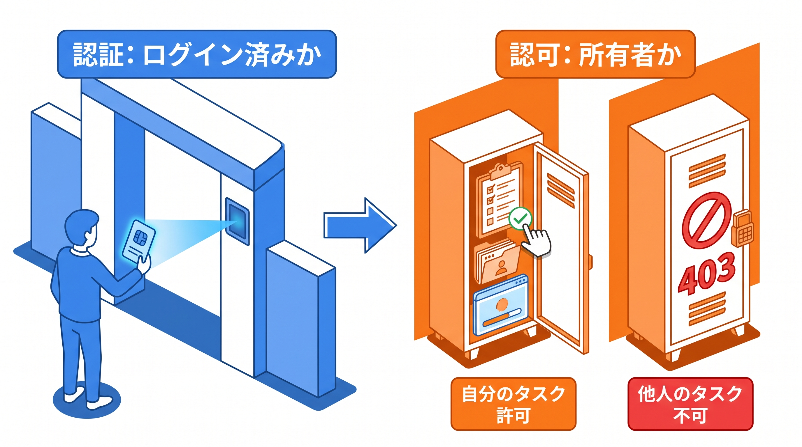
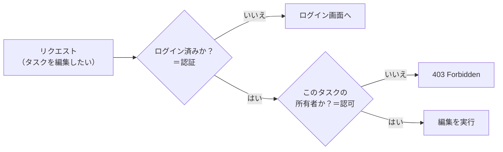

# 4-1 認可とは／Gate

📝 **前提知識**: このセクションは 2-1 Laravel Sail で環境構築する の内容を前提としています。

Chapter 4 では、認可（authorization）を扱います。「ログインしているか」だけでなく「この人がこの操作をしてよいか」を判定し、所有者だけが編集・削除できる制御を実装できるようにします。

| セクション | テーマ | 種類 |
|---|---|---|
| 4-1 認可とは／Gate | 認証と認可の違い・Gate | 概念 |
| 4-2 Policy の作成・登録・適用 | Policy で所有者ベースの認可 | 概念 |
| 4-3 ハンズオン: 投稿の所有者だけ編集・削除できるようにする | スターターキットで認可を実装 | ハンズオン |

📖 **この Chapter の進め方**: 4-1 で認証と認可の違いと、Gate による単純な認可を理解します。4-2 で、モデルに紐づく認可をまとめる Policy の作り方・登録・適用を学びます。最後に 4-3 で、スターターキット上に所有者ベースの認可を実装します。

## 🎯 このセクションで学ぶこと

- 認証（誰か）と認可（何をしてよいか）の違いを理解する
- 既習の auth ミドルウェア（ログイン必須）と認可の違いを理解する
- Gate による単純な認可を説明できる

このセクションでは、認可とは何かを認証と対比して捉え、その最初の道具である Gate を確認します。

💡 このセクションのコードは、認可の仕組みを理解するための例です。ここで手を動かす必要はありません。実際に実装するのは、4-3 のハンズオンと Part 4 の総合ハンズオンです。

---

## 導入: ログインさせるだけでは守れない

これまで、ログインが必要なページは auth ミドルウェアで保護してきました。これは「ログインしていない人を弾く」仕組みです。しかし、ログインさえしていれば何でもしてよい、というわけではありません。

たとえばタスク管理アプリで、ユーザー A が作ったタスクを、ログイン済みのユーザー B が編集・削除できてしまったら問題です。auth ミドルウェアは「ログイン済みかどうか」しか見ないため、ログインしている B はこの関門を通過してしまいます。必要なのは、「この B が、この 1 件のタスクに対して、編集してよいか」という、もう一段細かい判定です。これが認可です。

### 🧠 先輩エンジニアの思考プロセス

> 新人のころ、ログイン必須にしただけで「守った」気になっていました。あるとき、ログインユーザーなら誰でも他人の下書きを編集できると指摘されて青ざめたことがあります。認証で止まっていた発想を、「この人がこの 1 件に対して何をしてよいか」まで広げる。この一段を足すだけで、アプリの安全性は大きく変わります。



---

## 認証と認可の違い

似た言葉ですが、見ているものが異なります。

- **認証（authentication）**: 「あなたは誰か」を確かめること。ログイン（メールアドレスとパスワードの照合）がこれにあたります。Fortify が担当してきた領域です。
- **認可（authorization）**: 「その人が、この操作をしてよいか」を判断すること。たとえば「このタスクを編集してよいのは、それを作った本人だけ」という判断です。

認証は入り口で 1 回、認可は操作のたびに必要になります。ログインを通過した後も、「編集ボタンを押したとき」「削除しようとしたとき」に、その都度「してよいか」を確かめます。



🔑 認証は「門を通れるか」、認可は「門の先で、その操作をしてよいか」です。auth ミドルウェアは前者だけを見ます。後者を受け持つのが、これから学ぶ Gate と Policy です。

## auth ミドルウェアとの違い

既習の auth ミドルウェアは、ルートに対して「ログインしていなければログイン画面へ送る」という働きをしました。

```php
// routes/web.php
Route::middleware('auth')->group(function () {
    // ログイン必須のルート
});
```

これはルート単位の「ログイン必須」であり、**ログインした全員に同じ通行権** を与えます。「誰がログインしているか」によって扱いを変えることはしません。

一方、認可は **対象（多くの場合 1 件のモデル）** に対して「この人がこれをしてよいか」を判定します。同じ「タスク編集」ルートでも、自分のタスクなら許可、他人のタスクなら 403、というように、ログインユーザーと対象の関係で結果が変わります。auth ミドルウェアが「ログイン必須」までを担い、その先の「誰のものか」を認可が担う、という分担です。

## Gate による単純な認可

Laravel で認可を実装する道具は 2 つあります。**Gate** と **Policy** です。まずは単純な Gate から見ます。

Gate は、「ある操作をしてよいか」を判定する関数に名前を付けたものです。`App\Providers\AuthServiceProvider` の `boot` メソッドの中で `Gate::define` を使って定義します。第 1 引数が操作の名前、第 2 引数が「ログインユーザーと対象を受け取り、`true` / `false` を返す関数」です。

```php
// app/Providers/AuthServiceProvider.php
use App\Models\Task;
use App\Models\User;
use Illuminate\Support\Facades\Gate;

public function boot(): void
{
    Gate::define('update-task', function (User $user, Task $task) {
        return $user->id === $task->user_id;
    });
}
```

ここでは「`update-task`（タスク更新）をしてよいのは、そのタスクの `user_id` がログインユーザーの `id` と一致するとき」と定義しています。所有者チェックそのものです。

定義した Gate は、いくつかの方法で使えます。コントローラなどでは `Gate::allows` / `Gate::denies` で判定します。

```php
use Illuminate\Support\Facades\Gate;

if (Gate::denies('update-task', $task)) {
    abort(403);
}
```

`Gate::allows` は許可なら `true`、`Gate::denies` は不許可なら `true` を返します。不許可なら `abort(403)` で処理を止め、「禁止」を表す HTTP ステータス 403 を返します。ログインユーザーは Laravel が自動で渡すため、`$task` だけを渡せばよい点に注目してください。

Blade では `@can` ディレクティブで、ボタンの表示を切り替えられます。

```blade
{{-- 自分のタスクのときだけ編集ボタンを表示 --}}
@can('update-task', $task)
    <a href="{{ route('tasks.edit', $task) }}">編集</a>
@endcan
```

📝 ログインユーザー自身からも `$user->can('update-task', $task)` で判定できます。`Gate::allows` と同じ判定を、ユーザーオブジェクトを起点に書く形で、後の章のテストでも使います。

## Gate と Policy の使い分け

Gate は手軽ですが、`AuthServiceProvider` に判定関数が並んでいく形です。「タスクの更新」「タスクの削除」「タスクの閲覧」と増えていくと、1 つのモデルに関する認可があちこちに散らばってしまいます。

そこで、**特定のモデルに対する認可をまとめたい** ときは、Policy という専用クラスを使います。Policy は「`Task` に対する `update` / `delete` などの判定を 1 つのクラスに集めたもの」だと考えてください。所有者ベースの認可は、ほとんどがモデル単位（このタスク・この投稿）の判定なので、Policy が向いています。

| | Gate | Policy |
|---|---|---|
| 形 | 名前付きの判定関数 | モデルに紐づくクラス |
| 向いている用途 | モデルに紐づかない単純・横断的な権限 | 特定モデルに対する一連の認可 |
| 定義場所 | `AuthServiceProvider` の `boot` | `app/Policies` のクラス |

🔑 Gate と Policy は対立するものではなく、どちらも同じ認可の仕組みの上に立っています。実際、`@can` や `authorize` の書き方は両者でほとんど同じです。本教材で目標とする「所有者だけが編集・削除できる」認可は、モデル単位なので Policy で実装します。

---

## ✨ まとめ

- 認証は「あなたは誰か」、認可は「その人がこの操作をしてよいか」。認証は入り口で 1 回、認可は操作のたびに必要
- auth ミドルウェアは「ログイン必須」までを担い、ログインした全員に同じ通行権を与える。「誰のものか」による判定は認可が担う
- Gate は名前付きの判定関数。`AuthServiceProvider` の `boot` で `Gate::define` し、`Gate::allows` / `Gate::denies` や `@can` で使う。不許可なら `abort(403)`
- モデル単位の一連の認可（所有者ベースなど）は、判定をまとめられる Policy が向く

---

次のセクションでは、その Policy を実際に作ります。`make:policy` でモデルに紐づく Policy を作り、所有者チェック（`$user->id === $model->user_id`）を書き、自動探索または `$policies` への登録で Laravel に認識させ、コントローラの `authorize()` とビューの `@can` で適用して、非所有者には 403 を返すところまでを扱います。
