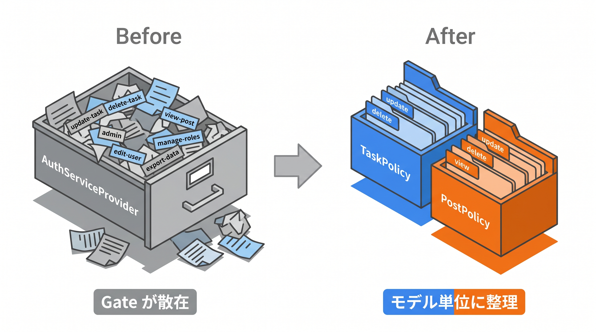
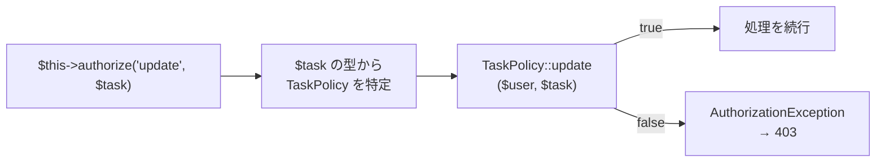

# 4-2 Policy の作成・登録・適用

📝 **前提知識**: このセクションは 4-1 認可とは／Gate の内容を前提としています。

## 🎯 このセクションで学ぶこと

- `make:policy` でモデルに紐づく Policy を作り、所有者チェックを書ける
- Policy を Laravel に認識させる（自動探索／`$policies` への登録）方法を理解する
- コントローラの `authorize()` とビューの `@can` で Policy を適用し、非所有者に 403 を返せる

このセクションでは、Policy を作る・登録する・適用するの 3 段階を順に追い、所有者だけが操作できる認可を組み立てます。

💡 このセクションのコマンドやコードは、Policy の仕組みを理解するための例です。ここで手を動かす必要はありません。実際に実装するのは、次の 4-3 のハンズオンと Part 4 の総合ハンズオンです。

---

## 導入: 認可のロジックをどこに置くか

4-1 で、モデル単位の認可は Policy が向いていると確認しました。Policy は「あるモデルに対する認可判定を 1 つのクラスにまとめたもの」です。`Task` に対する「更新してよいか」「削除してよいか」を `TaskPolicy` に集めておけば、タスクまわりの認可ルールは「このクラスを見ればよい」と一目で分かります。

Policy を使うには、3 つの段階があります。**作る** （`make:policy` でクラスを生成し判定を書く）、**登録する** （どのモデルに対応する Policy かを Laravel に知らせる）、**適用する** （コントローラやビューで呼び出す）。この順に見ていきます。

### 🧠 先輩エンジニアの思考プロセス

> Gate をいくつも定義していたら、タスクまわりの判定が `AuthServiceProvider` の中で他の権限に埋もれ、探すのに手間取るようになりました。Policy にモデル単位でまとめてからは、「このモデルの認可はこのクラス」と置き場所が決まり、レビューでも追いやすくなりました。認可は、書く場所を決めておくだけで保守がだいぶ楽になります。



---

## make:policy で Policy を作る

Policy は Artisan コマンドで生成します。`--model` オプションで対象のモデルを指定すると、そのモデル向けのメソッドの雛形が入った状態で作られます。

```bash
sail artisan make:policy TaskPolicy --model=Task
```

生成される `app/Policies/TaskPolicy.php` には、`viewAny` / `view` / `create` / `update` / `delete` / `restore` / `forceDelete` のメソッドが並びます。いずれも中身は空（`//`）で、戻り値の型は `bool` です。

```php
// app/Policies/TaskPolicy.php （生成直後の抜粋）
namespace App\Policies;

use App\Models\Task;
use App\Models\User;
use Illuminate\Auth\Access\Response;

class TaskPolicy
{
    public function viewAny(User $user): bool
    {
        //
    }

    public function update(User $user, Task $task): bool
    {
        //
    }

    public function delete(User $user, Task $task): bool
    {
        //
    }

    // view / create / restore / forceDelete も同様に生成される
}
```

各メソッドの名前は、後で適用するときの「操作名」になります。`update` メソッドは「このタスクを更新してよいか」、`delete` メソッドは「このタスクを削除してよいか」の判定です。第 1 引数にログインユーザー、第 2 引数に対象のモデルを受け取ります（`viewAny` や `create` は対象がまだ存在しないため、ユーザーだけを受け取ります）。

💡 生成された雛形のメソッドは、戻り値の型が `bool` です。中身が空（`//`）のまま呼び出すと、`bool` が返らずエラーになります。**使うメソッドには判定を書き、使わないメソッドは削除する** のが基本です（次の 4-3 では、所有者チェックを書く `update` と `delete` だけを残します）。

## 所有者チェックを書く

今回の目的は「所有者だけが編集・削除できる」ことなので、`update` と `delete` に所有者チェックを書きます。判定は 4-1 の Gate と同じで、「対象の `user_id` がログインユーザーの `id` と一致するか」です。

```php
// app/Policies/TaskPolicy.php
public function update(User $user, Task $task): bool
{
    return $user->id === $task->user_id;
}

public function delete(User $user, Task $task): bool
{
    return $user->id === $task->user_id;
}
```

これで、`TaskPolicy` は「更新・削除してよいのは所有者だけ」というルールを表すクラスになりました。`===` は型まで含めて一致を確かめる比較で、`id` 同士を厳密に突き合わせています。

🔑 認可ロジックがコントローラから消え、`TaskPolicy` に集約された点が重要です。「タスクを操作してよいのは誰か」を変えたくなったら、このクラスだけを直せばよくなります。

## Policy を登録する

作った Policy は、「どのモデルに対応するのか」を Laravel に知らせて初めて使えます。方法は 2 つあります。

1 つめは **自動探索** です。Laravel は、モデルが `app/Models`、Policy が `app/Policies` にあり、Policy 名が「モデル名 + Policy」（`Task` → `TaskPolicy`）という規約に従っていれば、対応を **自動的に見つけます**。`make:policy` で作った `TaskPolicy` はこの規約に沿うので、何も書かなくても認識されます。

2 つめは **明示的な登録** です。`App\Providers\AuthServiceProvider` の `$policies` 配列に、モデルと Policy の対応を書きます。

```php
// app/Providers/AuthServiceProvider.php
use App\Models\Task;
use App\Policies\TaskPolicy;

protected $policies = [
    Task::class => TaskPolicy::class,
];
```

自動探索があるので明示的な登録は必須ではありませんが、`$policies` に書いておくと「このアプリにどんな Policy があるか」が 1 か所で見渡せます。規約から外れた名前を使う場合も、明示的な登録が必要です。本教材では、対応が一目で分かる明示的な登録を採用します。

## コントローラで適用する

登録できたら、コントローラで認可を呼び出します。コントローラの基底クラスには認可用の機能が組み込まれているため、`$this->authorize()` が使えます。第 1 引数に操作名（Policy のメソッド名）、第 2 引数に対象のモデルを渡します。

```php
// app/Http/Controllers/TaskController.php
public function edit(Task $task)
{
    $this->authorize('update', $task);

    return view('tasks.edit', compact('task'));
}

public function update(UpdateTaskRequest $request, Task $task)
{
    $this->authorize('update', $task);

    // 更新処理
}
```

`$this->authorize('update', $task)` は、`$task` の型（`Task`）から対応する `TaskPolicy` を探し、その `update` メソッドにログインユーザーと `$task` を渡して判定します。



許可なら何も起きず処理が続き、不許可なら `Illuminate\Auth\Access\AuthorizationException` が投げられ、Laravel がこれを **403** のレスポンスに変換します。ログインユーザーは Laravel が自動で渡すので、引数に書く必要はありません。

📝 `$this->authorize()` を呼べるのは、コントローラの基底クラス `App\Http\Controllers\Controller` が認可用のトレイト（`AuthorizesRequests`）を取り込んでいるからです。1-2 で見た継承により、各コントローラはこの機能を受け継いでいます。

## ビューで使う

認可は、画面の出し分けにも使います。Blade の `@can` ディレクティブで、「許可されているときだけ表示する」ブロックを作れます。これで、他人のタスクには編集・削除ボタンを出さないようにできます。

```blade
{{-- 自分のタスクのときだけ編集・削除ボタンを表示 --}}
@can('update', $task)
    <a href="{{ route('tasks.edit', $task) }}">編集</a>
@endcan

@cannot('update', $task)
    <span>（編集できません）</span>
@endcannot
```

`@can('update', $task)` は、コントローラの `authorize` と同じく `TaskPolicy::update` の判定を使います。判定ロジックが Policy に 1 か所だけあり、コントローラとビューの両方がそれを参照する形です。

⚠️ **注意**: `@can` でボタンを隠すのは、あくまで画面の見た目の話です。ボタンを消しても、URL を直接たたかれれば処理は走ります。**コントローラ側の `authorize()` を省略しない** でください。表示の制御（`@can`）と処理の制御（`authorize()`）は、両方そろって初めて安全になります。

---

## ✨ まとめ

- `make:policy TaskPolicy --model=Task` で、モデル向けメソッド（`update` / `delete` など）の雛形を持つ Policy を生成する
- 使うメソッドに所有者チェック（`return $user->id === $task->user_id;`）を書く。空のままだと不許可になる
- 登録は、規約に沿った自動探索か、`AuthServiceProvider` の `$policies` への明示的な登録。本教材は明示的な登録を使う
- コントローラでは `$this->authorize('update', $task)`（不許可なら 403）、ビューでは `@can('update', $task)` で適用する
- `@can` は表示の制御、`authorize()` は処理の制御。URL 直打ちに備え、`authorize()` は省略しない

---

次のセクションは、この章のハンズオンです。Fortify 認証・`Post` モデル・`PostController`・シーダー・Blade を同梱し、認可だけが未実装のスターターキットをクローンします。そこに `PostPolicy` を実装し、所有者のみが編集・削除でき、非所有者には 403 を返し、他人の投稿には `@can` で編集・削除ボタンを出さないところまでを、実際に手を動かして仕上げます。
