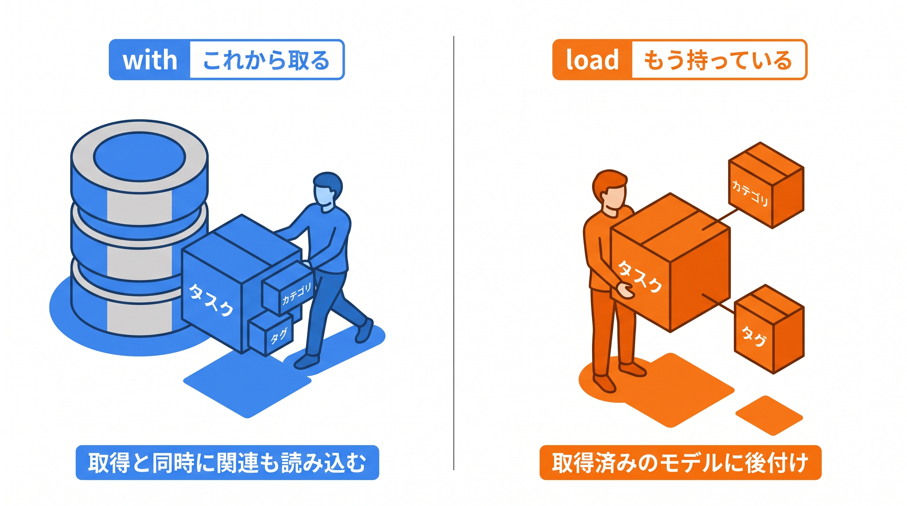
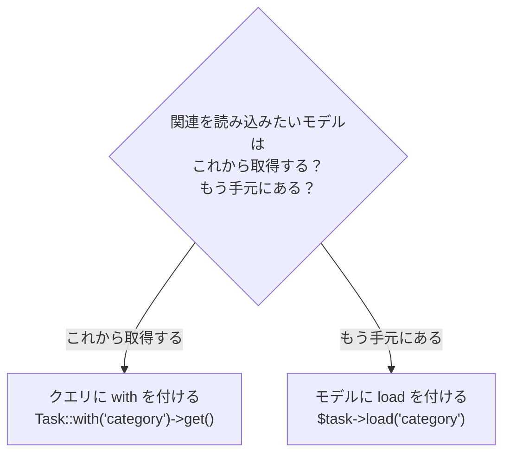

# 5-2 Eager Loading の使い分けと N+1

📝 **前提知識**: このセクションは 5-1 集計クエリとランキング の内容を前提としています。

## 🎯 このセクションで学ぶこと

- コレクション向けの `with` / `withCount` と、取得済みモデル向けの `load` / `loadCount` の違いを理解する
- ルートモデルバインディングで受け取ったモデルに、`load` で関連を後付けする使い方を理解する
- API の一覧（`with`）と詳細（`load`）での Eager Loading の使い分けを理解する

このセクションでは、N+1 を避けるための Eager Loading を、`with` 系と `load` 系の使い分けという観点から整理します。

💡 このセクションのコードは、`with` と `load` の使い分けを理解するための例です。ここで手を動かす必要はありません。実際に実装するのは Part 4 の総合ハンズオンです。

---

## 導入: 「これから取る」のか「もう持っている」のか

N+1 問題と、`with()` による Eager Loading は、すでに学んだとおりです。一覧でタスクごとに `$task->category` をたどると、タスクの数だけカテゴリの問い合わせが走ってしまう。これを `Task::with('category')->get()` のように、あらかじめ関連をまとめて読み込むことで防げます。

ここで一段踏み込みたいのが、関連を読み込むメソッドには **2 系統** ある、という点です。`with` のようにクエリを組み立てる段階で読み込むものと、`load` のようにすでに取得したモデルに後から読み込むものです。どちらも N+1 を防ぎますが、使う場面が異なります。取り違えると、せっかくモデルを持っているのにもう一度取り直す、という無駄が生まれます。

### 🧠 先輩エンジニアの思考プロセス

> ルートモデルバインディングで受け取った `$task` に `with()` を使おうとして、わざわざ `find` し直していた時期がありました。すでに手元にあるモデルには `load()` を後付けすればいい、と気づいてから、詳細画面の実装がすっきりしました。`with` は「これから取る」、`load` は「もう持っている」への合図だと捉えています。



---

## with と load の違い

両者の違いは、「いつ関連を読み込むか」です。

- **`with`**: これから実行するクエリに対して、「ついでに関連も読み込む」よう指示します。`Model::with(...)->get()` のように、まだデータを取得する **前** に使います。
- **`load`**: すでに取得した **後** のモデル（やコレクション）に対して、「この関連を読み込んで」と後付けします。`$model->load(...)` の形です。

```php
// with: これからクエリで取得する（一覧など）
$tasks = Task::with('category')->get();

// load: すでに取得済みのモデルに後付けする
$task = Task::find($id);
$task->load('category');
```



🔑 結果（関連が読み込まれた状態）は同じです。違いは、関連の読み込みを「クエリの組み立て時」に指示するか、「取得後のモデル」に指示するか、です。

## withCount / loadCount などの対応

5-1 で学んだ集計メソッドにも、同じ 2 系統の対応があります。`with` 系がクエリ向け、`load` 系が取得済みモデル向けです。

| これからクエリで取得する | すでに取得済みのモデルに後付けする |
|---|---|
| `with` | `load` |
| `withCount` | `loadCount` |
| `withAvg` | `loadAvg` |
| `withSum` | `loadSum` |

```php
// 取得済みのモデルに、関連と件数を後付けする
$task->load('tags');
$task->loadCount('tags');
```

名前の頭が `with` か `load` かを見れば、「クエリ前か・取得後か」が判断できます。

## ルートモデルバインディングと load

`load` がとくに活きるのが、ルートモデルバインディングです。コントローラのアクションの引数で `show(Task $task)` のようにモデルを受け取ると、Laravel が URL の ID から該当するタスクを **すでに取得した状態** で渡してくれます。

```php
// app/Http/Controllers/TaskController.php
public function show(Task $task)
{
    // $task はすでに取得済み。関連は load で後付けする
    $task->load('category', 'tags');
    $task->loadCount('tags');

    return view('tasks.show', compact('task'));
}
```

ここで `Task::with(...)->find($task->id)` と書くと、せっかく受け取った `$task` を捨てて取り直すことになります。すでに手元にあるのだから、`load` で関連だけを足すのが自然です。

📝 ルートモデルバインディング（引数でモデルを受け取る仕組み）そのものは、Part 3 で詳しく扱います。ここでは「コントローラの引数でモデルを受け取ったときは、取得済みなので `load` を使う」とだけ押さえておけば十分です。

## API での Eager Loading の使い分け

この使い分けは、Part 3 で作る公開 API でそのまま効いてきます。API の一覧と詳細では、典型的に次のように分かれます。

- **一覧**: 検索やページネーションのためにクエリを組み立て、`with` / `withCount` / `withAvg` を付けてから取得する
- **詳細**: ルートモデルバインディングで受け取った 1 件のモデルに、`load` / `loadCount` / `loadAvg` を後付けする

```php
// 一覧: クエリを組み立てて取得する → with 系
$tasks = Task::with('category')
    ->withCount('tags')
    ->paginate(20);

// 詳細: 受け取った 1 件に後付けする → load 系
public function show(Task $task)
{
    $task->load('category');
    $task->loadCount('tags');

    return new TaskResource($task);
}
```

💡 一覧では関連や集計を加えても 1 回のまとまった問い合わせで済み、N+1 を避けられます。詳細では、すでに取得した 1 件に必要な関連だけを足します。「一覧は `with`、詳細は `load`」という対応を覚えておくと、API を書くときに迷いません（`TaskResource` のようなレスポンス整形は 7-2 で扱います）。

---

## ✨ まとめ

- 関連を読み込むメソッドは 2 系統ある。`with` は「これからクエリで取得する」前に、`load` は「すでに取得済みのモデル」に後付けする
- `withCount` / `withAvg` / `withSum` にも、取得済みモデル向けの `loadCount` / `loadAvg` / `loadSum` が対応する
- ルートモデルバインディングで受け取ったモデルは取得済みなので、`load` で関連を足す。`with` で取り直さない
- API では「一覧は `with`、詳細は `load`」が基本。どちらも N+1 を避けつつ必要な関連・集計を読み込める

---

この Chapter では、集計とパフォーマンスを扱いました。`withCount` / `withAvg` / `withSum` で関連を集計し、`has` / `whereHas` で絞り込み、`orderByDesc` でランキングを作る方法を学び、N+1 を避けるための `with` と `load` の使い分けを整理しました。集計も Eager Loading も、「処理を PHP のループではなくデータベースに任せ、1 回のまとまった問い合わせで取る」という同じ考え方の上にあります。

次の Chapter では、自動テストに進みます。ここまで作ってきた機能が期待どおり動くことを、手作業の確認ではなくコードで保証できるようにします。次のセクションではまず、テストの目的と Feature テスト・Unit テストの違いを理解し、`RefreshDatabase`・Factory・`actingAs`、そしてテスト用データベースの設定を押さえて、基本的なテストの書き方を説明できるようになります。
