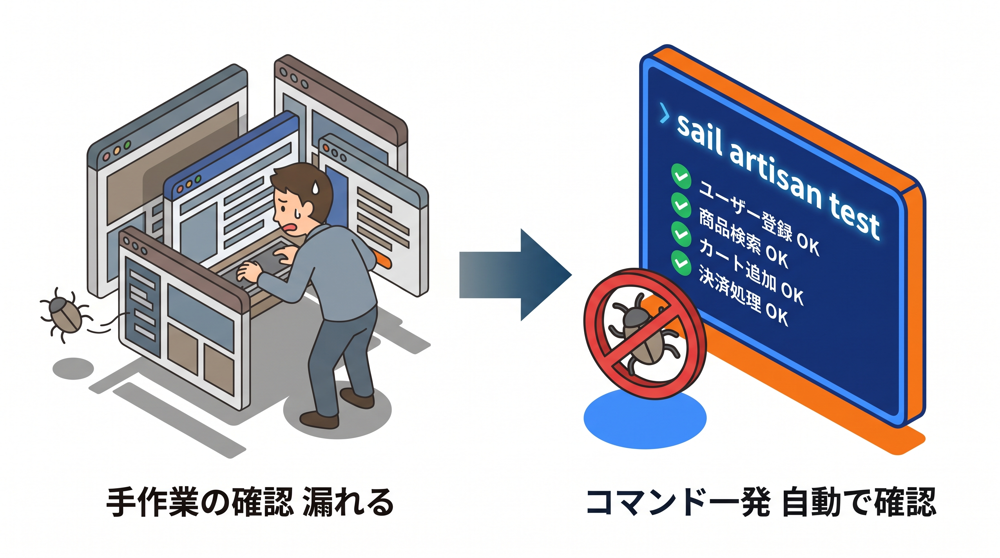

# 6-1 テストの基礎（PHPUnit / Factory / RefreshDatabase）

📝 **前提知識**: このセクションは 2-1 Laravel Sail で環境構築する の内容を前提としています。

Chapter 6 では、自動テストを扱います。これまで作ってきた機能が期待どおり動くことを、手作業ではなくコードで確認できるようにします。テストの土台を固めてから、機能テスト・API テストへと進みます。

| セクション | テーマ | 種類 |
|---|---|---|
| 6-1 テストの基礎（PHPUnit / Factory / RefreshDatabase） | テストの目的と土台 | 概念 |
| 6-2 機能テスト（CRUD・認可・バリデーション） | 機能テストの書き方 | 概念 |
| 6-3 API テストとカバレッジ | JSON API のテストとカバレッジ | 概念 |

📖 **この Chapter の進め方**: 6-1 でテストの目的と Feature / Unit の違い、テスト用データベース・Factory・`actingAs` という土台を押さえます。6-2 で CRUD・認可・バリデーションの機能テスト、6-3 で JSON API のテストとカバレッジの測り方を学びます。実際にまとまったテストを書くのは、Part 4 の総合ハンズオン（10-4）です。

## 🎯 このセクションで学ぶこと

- テストの目的と、Feature テスト・Unit テストの違いを理解する
- テスト用データベースの設定と `RefreshDatabase` の役割を理解する
- Factory でテストデータを作り、`actingAs` でログイン状態を作って、基本的なテストを書ける

このセクションでは、テストを書き始めるための土台（設定・道具・最初の 1 本）をそろえます。

💡 このセクションのコマンドやコードは、テストの書き方を理解するための例です。ここで手を動かす必要はありません。実際にテストを書くのは Part 4 の総合ハンズオン（10-4）です。

---

## 導入: 手作業の動作確認は、いつか追いつかなくなる

機能を 1 つ追加・修正するたびに、関連する画面をブラウザで開いて確かめる。最初のうちはそれで足ります。しかし機能が増えると、「ある修正が、別の場所を壊していないか」を毎回手で確かめるのは現実的でなくなります。確認漏れは、たいてい一番見たくないタイミングで表面化します。

自動テストは、この「壊れていないことの確認」をコードにしておく仕組みです。一度書いておけば、`sail artisan test` の一発で、いつでも同じ確認を繰り返せます。2026年2月以前の教材では一度紹介した程度のテストを、この Chapter では「自分で書ける」水準まで固めます。

### 🧠 先輩エンジニアの思考プロセス

> 機能を 1 つ直すたびに、関連画面を手でポチポチ確認していました。ある日、直したつもりが別の場所を壊していて、リリース後に発覚したことがあります。テストを書いてからは、コマンド一発で「前に動いていたものが今も動く」を確認できる。最初の一本を書く手間は、すぐに取り返せます。



---

## テストの目的と Feature / Unit の違い

テストは、「ある入力に対して、期待どおりの結果になるか」をコードで確かめるものです。Laravel のテストは、置き場所によって 2 種類に分かれます。

- **Feature テスト** （`tests/Feature`）: ルート・コントローラ・データベースまでを通した、機能全体の動きを確かめます。「`/tasks` に GET したら 200 が返る」「フォームを送るとデータベースに保存される」のように、HTTP リクエストを起点に検証します。アプリのテストの多くはこちらです。
- **Unit テスト** （`tests/Unit`）: モデルのメソッドやリレーションなど、小さな単位を単独で確かめます。「`Task` の `category` リレーションが正しく定義されているか」のような検証です。

🔑 まず「機能が動くか」を Feature テストで確かめ、必要に応じてモデルなどの細かい部分を Unit テストで補う、と考えておけば十分です。どちらも書き方の骨格は同じです。

## テスト用データベースの設定

テストでは、データを作ったり消したりします。これを開発用のデータベースで行うと、開発中のデータが壊れてしまいます。そこで、**テスト専用のデータベース** を使います。

ありがたいことに、Laravel Sail は MySQL コンテナの初回起動時に、開発用とは別に `testing` という名前の **テスト専用データベースを自動で作ります**。あとは、テスト実行時にこの `testing` を使うよう指定するだけです。

Laravel 10 の `phpunit.xml` では、データベースの指定が初期状態でコメントアウトされています。`<php>` セクションに、次の 1 行を加えます（コメントアウトされている `DB_DATABASE` の行を有効にして値を `testing` にする形でも構いません）。

```xml
<!-- phpunit.xml の <php> セクションに追加 -->
<env name="DB_DATABASE" value="testing"/>
```

これで、テストは開発用の `laravel` ではなく、`testing` データベースに対して実行されます。接続先（MySQL）は `.env` の設定がそのまま使われます。

💡 もっと高速にしたい場合は、`phpunit.xml` でコメントアウトされている `DB_CONNECTION` を `sqlite`、`DB_DATABASE` を `:memory:` にして、メモリ上の SQLite を使う方法もあります。ただし MySQL と細かな挙動が異なることがあるため、本教材では本番と同じ MySQL の `testing` データベースを使います。

### RefreshDatabase の役割

テストは、互いに影響し合わないことが大切です。あるテストが作ったデータが、次のテストに残っていると、結果が安定しません。これを防ぐのが `RefreshDatabase` トレイトです。

```php
use Illuminate\Foundation\Testing\RefreshDatabase;

class TaskTest extends TestCase
{
    use RefreshDatabase;
    // ...
}
```

`use RefreshDatabase;` を書いておくと、**各テストの実行前にデータベースがまっさらな状態に戻ります**。前のテストで作ったデータは持ち越されず、どのテストも「空のデータベース」から始められます。これにより、テストの順番に関係なく、いつでも同じ結果が得られます。

## Factory でテストデータを作る

テストには、ユーザーやタスクといった前提データが必要です。毎回手で書くのは大変なので、Factory（既習）でまとめて作ります。テストの中では `Model::factory()` を起点に使います。

```php
use App\Models\Task;
use App\Models\User;

// 1 件作成して保存する
$user = User::factory()->create();

// 3 件まとめて作る
$users = User::factory()->count(3)->create();

// 属性を指定して作る（指定しない項目はファクトリの既定値）
$task = Task::factory()->create(['title' => '買い物']);

// 別のモデルに属する形で作る（belongsTo の外部キーを設定）
$task = Task::factory()->for($user)->create();
```

- `count(n)` で複数件、`create([...])` で一部の属性を指定して作れます
- `for($user)` は、`belongsTo` の関連先を指定します。上の例では、作られたタスクの `user_id` が `$user` のものになります

📝 関連の向きによって `for`（`belongsTo` 側）と `has`（`hasMany` 側）を使い分けられます。また、ファクトリに「完了済み」などの状態（state）を定義しておけば、`Task::factory()->done()->create()` のように呼べます。まずは `create` / `count` / `for` の 3 つを押さえれば、たいていのテストデータは用意できます。

## actingAs でログイン状態を作る

認証が必要な機能をテストするには、「ログイン済み」の状態を作る必要があります。`actingAs` に、ログインさせたいユーザーを渡します。

```php
$user = User::factory()->create();

// 以降のリクエストは $user としてログイン済みになる
$this->actingAs($user)->get('/tasks');
```

`actingAs($user)` を挟むと、それに続くリクエストは `$user` でログインしている扱いになります。これにより、認証が必要なページや、所有者だけが操作できる機能（4 章の認可）もテストできます。

## 最初のテストを書いて実行する

テストのファイルは Artisan で生成します。

```bash
sail artisan make:test TaskTest
```

これで `tests/Feature/TaskTest.php` が作られます（Unit テストにしたいときは `--unit` を付けます）。ここまでの道具を組み合わせて、最初の 1 本を書いてみます。

```php
// tests/Feature/TaskTest.php
namespace Tests\Feature;

use App\Models\User;
use Illuminate\Foundation\Testing\RefreshDatabase;
use Tests\TestCase;

class TaskTest extends TestCase
{
    use RefreshDatabase;

    public function test_ログインユーザーはタスク一覧を表示できる(): void
    {
        // 準備: ユーザーを作る
        $user = User::factory()->create();

        // 実行: ログインして一覧にアクセスする
        $response = $this->actingAs($user)->get('/tasks');

        // 検証: 200 が返る
        $response->assertOk();
    }
}
```

テストメソッドは `test_` で始めるか、名前に意味を込めて日本語で書けます。中身は「準備（データを作る）→ 実行（操作する）→ 検証（結果を確かめる）」の 3 段で組むと読みやすくなります。`assertOk()` は「HTTP ステータスが 200 か」を確かめるアサーション（表明）です。

テストの実行は、次のコマンドです。

```bash
sail artisan test
```

成功すると、次のような出力になります（所要時間は環境により異なります）。

```text
   PASS  Tests\Feature\TaskTest
  ✓ ログインユーザーはタスク一覧を表示できる

  Tests:    1 passed
```

緑色の `PASS` と `✓` が、テストが通ったことを表します。失敗したテストがあれば、どの検証が期待と食い違ったかが赤く表示されます。

🔑 この「準備 → 実行 → 検証」と、`RefreshDatabase`・Factory・`actingAs`・アサーションの組み合わせが、すべてのテストの骨格です。次のセクションからは、検証に使うアサーションの種類を増やし、CRUD・認可・バリデーション・API をテストできるようにしていきます。

---

## ✨ まとめ

- テストは「期待どおりに動くか」をコードで確かめる仕組み。機能全体を通す Feature テストと、小さな単位を確かめる Unit テストがある
- テストは専用のデータベースで行う。Sail が用意する `testing` を、`phpunit.xml` の `DB_DATABASE` で指定する
- `RefreshDatabase` で各テスト前にデータベースをまっさらに戻し、テストどうしが影響し合わないようにする
- Factory（`create` / `count` / `for`）でテストデータを作り、`actingAs` でログイン状態を作る
- テストは「準備 → 実行 → 検証」の 3 段で組み、`sail artisan test` で実行する

---

次のセクションでは、検証に使うアサーションを広げます。HTTP の結果を確かめる `assertOk` / `assertRedirect` / `assertForbidden` / `assertSessionHasErrors` と、データベースの状態を確かめる `assertDatabaseHas` / `assertDatabaseMissing` / `assertDatabaseCount`（ピボットの検証を含む）を使い、CRUD・認可・バリデーションをテストする方法を学びます。
