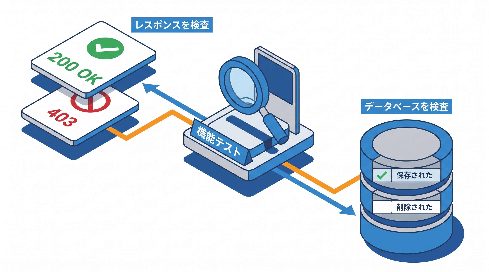

# 6-2 機能テスト（CRUD・認可・バリデーション）

📝 **前提知識**: このセクションは 6-1 テストの基礎（PHPUnit / Factory / RefreshDatabase） と 4-2 Policy の作成・登録・適用 の内容を前提としています。

## 🎯 このセクションで学ぶこと

- HTTP リクエストを送るテストと、結果を確かめる HTTP アサーション（`assertOk` / `assertRedirect` / `assertForbidden` / `assertSessionHasErrors`）を使える
- データベースの状態を確かめる DB アサーション（`assertDatabaseHas` / `assertDatabaseMissing` / `assertDatabaseCount`）を、ピボットの検証も含めて使える
- CRUD・認可・バリデーションを機能テストで検証する方法を理解する

このセクションでは、6-1 の土台の上に、機能テストでよく使うアサーションを一通りそろえます。

💡 このセクションのテストコードは、書き方を理解するための例です。ここで手を動かす必要はありません。実際にテストを書くのは Part 4 の総合ハンズオン（10-4）です。

---

## 導入: 守りたい挙動を、テストで固定する

6-1 で、テストの骨格（準備 → 実行 → 検証）と道具（`RefreshDatabase`・Factory・`actingAs`）をそろえました。残るのは「検証」の引き出しを増やすことです。

機能テストでは、大きく 2 種類のことを確かめます。1 つは **HTTP レスポンス** で、「ステータスは 200 か」「ログイン画面にリダイレクトされたか」「403 で弾かれたか」を見ます。もう 1 つは **データベースの状態** で、「保存されたか」「消えたか」「件数は合っているか」を見ます。この 2 つを押さえれば、CRUD・認可・バリデーションのほとんどはテストできます。

### 🧠 先輩エンジニアの思考プロセス

> 認可のテストを書いておいてよかったと一番感じたのは、リファクタの最中に `authorize` を 1 行消してしまったときです。画面では気づけない抜けを、`assertForbidden` のテストが即座に赤で教えてくれました。403 やバリデーションエラーといった失敗系のテストこそ、本当に守りたい挙動を固定してくれます。



---

## HTTP リクエストを送るテスト

機能テストは、テストの中から実際に HTTP リクエストを送ります。`get` / `post` / `put` / `delete` が、それぞれの HTTP メソッドに対応します。

```php
// 一覧を表示する
$this->get(route('tasks.index'));

// フォームを送信して作成する
$this->post(route('tasks.store'), ['title' => 'レポート作成']);

// 更新する
$this->put(route('tasks.update', $task), ['title' => '修正後タイトル']);

// 削除する
$this->delete(route('tasks.destroy', $task));
```

認証が必要なら、6-1 の `actingAs` を前に挟みます。また、`back()`（直前のページに戻る）リダイレクトを検証したいときは、`from()` で「どこから来たか」を先に設定しておきます。

```php
$this->actingAs($user)
    ->from(route('tasks.show', $task))
    ->post(route('favorites.toggle', $task))
    ->assertRedirect(route('tasks.show', $task));
```

## HTTP アサーション

リクエストの戻り値（レスポンス）に対して、結果を確かめるアサーションをつなげます。代表的なものは次の 4 つです。

| アサーション | 確かめること |
|---|---|
| `assertOk()` | HTTP ステータスが 200（正常）か |
| `assertRedirect($url)` | 指定した URL へリダイレクトしたか |
| `assertForbidden()` | HTTP ステータスが 403（禁止）か |
| `assertSessionHasErrors($keys)` | バリデーションエラーがセッションにあるか |

たとえば「ログインしていない人が作成画面に入れず、ログイン画面へ送られる」ことは、次のように確かめます。

```php
public function test_未ログインユーザーは作成画面にアクセスできない(): void
{
    $this->get(route('tasks.create'))
        ->assertRedirect(route('login'));
}
```

## DB アサーション

データベースの状態は、テストクラスの `$this` から呼ぶアサーションで確かめます。第 1 引数にテーブル名、第 2 引数に「一致してほしい列の値」を渡します。

| アサーション | 確かめること |
|---|---|
| `assertDatabaseHas($table, [...])` | 条件に合う行が存在するか |
| `assertDatabaseMissing($table, [...])` | 条件に合う行が存在しないか |
| `assertDatabaseCount($table, $n)` | テーブルの行数が `$n` か |

これらは、`tasks` のような通常のテーブルだけでなく、**ピボットテーブルの検証** にもそのまま使えます。テーブル名にピボット名（`task_tag` など）を渡すだけです。

## CRUD のテスト

作成（store）のテストを、HTTP アサーションと DB アサーションを組み合わせて書いてみます。タスクの作成と、同時に行うタグ付け（ピボットへの保存）の両方を確かめます。

```php
public function test_認証ユーザーはタスクを作成しタグを付けられる(): void
{
    $user = User::factory()->create();
    $tags = Tag::factory()->count(2)->create();

    $response = $this->actingAs($user)->post(route('tasks.store'), [
        'title' => 'レポート作成',
        'tags' => $tags->pluck('id')->toArray(),
    ]);

    $task = Task::where('title', 'レポート作成')->first();

    // リダイレクト先（詳細画面）を確認
    $response->assertRedirect(route('tasks.show', $task));

    // tasks テーブルに保存されたか
    $this->assertDatabaseHas('tasks', [
        'user_id' => $user->id,
        'title' => 'レポート作成',
    ]);

    // ピボット task_tag にタグ付けが保存されたか
    foreach ($tags as $tag) {
        $this->assertDatabaseHas('task_tag', [
            'task_id' => $task->id,
            'tag_id' => $tag->id,
        ]);
    }
}
```

削除（destroy）のテストでは、`assertDatabaseMissing` で「消えたこと」を確かめます。

```php
public function test_認証ユーザーは自分のタスクを削除できる(): void
{
    $user = User::factory()->create();
    $task = Task::factory()->for($user)->create();

    $this->actingAs($user)
        ->delete(route('tasks.destroy', $task))
        ->assertRedirect(route('tasks.index'));

    $this->assertDatabaseMissing('tasks', ['id' => $task->id]);
}
```

## 認可のテスト

4 章で実装した「所有者だけが操作できる」認可は、テストで守るべき重要な挙動です。確かめ方は 2 通りあります。

1 つは、HTTP を通して「非所有者が操作すると 403 になる」ことを確かめる方法です。

```php
public function test_他人のタスクは削除できない(): void
{
    $owner = User::factory()->create();
    $task = Task::factory()->for($owner)->create();
    $other = User::factory()->create();

    $this->actingAs($other)
        ->delete(route('tasks.destroy', $task))
        ->assertForbidden();

    // 削除されずに残っている
    $this->assertDatabaseHas('tasks', ['id' => $task->id]);
}
```

もう 1 つは、Policy を直接呼んで判定だけを確かめる方法です。6-1 で触れた `$user->can(...)` を使います。HTTP を経由しないぶん、認可ロジックそのものを手早く検証できます。

```php
public function test_タスクの更新は所有者だけが許可される(): void
{
    $owner = User::factory()->create();
    $task = Task::factory()->for($owner)->create();
    $other = User::factory()->create();

    $this->assertTrue($owner->can('update', $task));
    $this->assertFalse($other->can('update', $task));
}
```

## バリデーションのテスト

バリデーションは、「不正な入力が弾かれること」を確かめます。`assertSessionHasErrors` で、期待する項目にエラーが付いたかを見ます。あわせて「保存されていないこと」も確かめると、より確実です。

```php
public function test_タイトルがないとタスクを保存できない(): void
{
    $user = User::factory()->create();

    $response = $this->actingAs($user)->post(route('tasks.store'), [
        'title' => '', // 必須項目を空にする
    ]);

    // title にバリデーションエラーが付く
    $response->assertSessionHasErrors('title');

    // 1 件も保存されていない
    $this->assertDatabaseCount('tasks', 0);
}
```

🔑 「正しい入力で成功する」テストだけでなく、「不正な入力で失敗する」「権限がなければ 403 になる」という **失敗系のテスト** を書くことが大切です。アプリが本当に守りたいのは、この「してはいけないことが、できないこと」だからです。

⚠️ **注意**: ここで示したテストは、Part 4 で作るタスク管理アプリ（`tasks` / `task_tag` / 認可など）を前提にした例です。本セクションの目的は書き方を理解することなので、今はコードを書いて実行する必要はありません。まとまったテスト一式は、総合ハンズオン（10-4）で実際に書きます。

---

## ✨ まとめ

- 機能テストは `get` / `post` / `put` / `delete` で HTTP リクエストを送り、レスポンスとデータベースの両方を確かめる
- HTTP アサーション: `assertOk`（200）・`assertRedirect`（リダイレクト先）・`assertForbidden`（403）・`assertSessionHasErrors`（バリデーションエラー）
- DB アサーション: `assertDatabaseHas` / `assertDatabaseMissing` / `assertDatabaseCount`。ピボットテーブル（`task_tag` など）の検証にも使える
- 認可は「非所有者は 403」を HTTP で確かめるほか、`$user->can(...)` で Policy を直接検証できる
- 成功系だけでなく、403 やバリデーションエラーといった失敗系のテストが、守りたい挙動を固定する

---

次のセクションでは、画面ではなく JSON を返す API のテストに進みます。`getJson` / `postJson` 系でリクエストを送り、`assertJsonStructure` / `assertJsonPath` / `assertJsonCount` / `assertJsonValidationErrors` でレスポンスの構造や値を確かめる方法を学びます。あわせて、`sail artisan test --coverage` でテストがコードのどれだけを通ったか（カバレッジ）を測り、目標 60% を確認する方法を押さえます。
