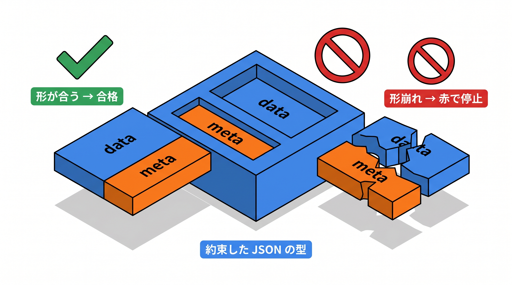

# 6-3 API テストとカバレッジ

📝 **前提知識**: このセクションは 6-2 機能テスト（CRUD・認可・バリデーション） の内容を前提としています。

## 🎯 このセクションで学ぶこと

- `getJson` / `postJson` 系で JSON API にリクエストを送る方法を理解する
- `assertJsonStructure` / `assertJsonPath` / `assertJsonCount` / `assertJsonValidationErrors` でレスポンスを検証できる
- HTTP ステータス（200 / 201 / 204 / 404 / 422）を検証する方法を理解する
- `sail artisan test --coverage` でカバレッジを測り、目標 60% を確認する方法を理解する

このセクションでは、JSON を返す API のテストの「型」と、カバレッジの測り方を押さえます。

💡 このセクションのテストコードやコマンドは、書き方を理解するための例です。ここで手を動かす必要はありません。実際に書くのは Part 4 の総合ハンズオン（10-4）です。

---

## 導入: 画面のテストと、API のテストの違い

6-2 までは、画面（HTML）を返す機能をテストしてきました。そこでは「200 が返るか」「リダイレクトしたか」「セッションにエラーが入ったか」を確かめました。

API のテストは、見るものが少し変わります。API はリダイレクトせず、**JSON のレスポンス** を返します。確かめたいのは、「正しいステータスコードか（201 で作成、404 で見つからない、など）」と「JSON の構造や値が約束どおりか」です。Laravel には、JSON 専用のリクエストとアサーションが用意されており、これらを使えば API のテストも機能テストと同じ感覚で書けます。

### 🧠 先輩エンジニアの思考プロセス

> API のレスポンス形を、後から「ちょっとだけ」変えたつもりが、利用側のアプリを壊したことがあります。`assertJsonStructure` でキーの形を固定しておくと、うっかりの形崩れがテストで赤く止まる。画面のテストが「見えるか」を守るなら、API のテストは「約束した構造を返すか」を守る、という違いだと捉えています。



---

## JSON リクエストを送る

API には、`get` などの代わりに、末尾に `Json` が付いたメソッドを使います。これらは「JSON を期待する」というヘッダーを自動で付け、レスポンスを JSON として扱います。

```php
// 一覧を取得する
$this->getJson('/api/v1/tasks');

// 作成する
$this->postJson('/api/v1/tasks', ['title' => 'レポート作成']);

// 更新する
$this->putJson("/api/v1/tasks/{$task->id}", ['title' => '修正後']);

// 削除する
$this->deleteJson("/api/v1/tasks/{$task->id}");
```

`Json` 付きのメソッドを使うと、バリデーション失敗時にもリダイレクトではなく JSON（ステータス 422）が返るようになります。API のテストでは、これらを使うのが基本です。

## JSON アサーション

レスポンスの JSON を検証するアサーションには、目的の異なるものがいくつかあります。

| アサーション | 確かめること |
|---|---|
| `assertJsonStructure([...])` | JSON が指定したキーの構造を持つか（値は問わない） |
| `assertJsonPath($path, $value)` | 指定した位置の値が一致するか |
| `assertJsonCount($count, $key)` | 指定したキーの配列の要素数が合うか |
| `assertJsonValidationErrors($keys)` | 指定した項目にバリデーションエラーがあるか |

`assertJsonStructure` は、レスポンスの「形」を確かめます。配列の各要素を表すには `*` を使います。

```php
public function test_一覧は data と meta の構造を返す(): void
{
    Task::factory()->count(3)->create();

    $response = $this->getJson('/api/v1/tasks');

    $response->assertOk();
    $response->assertJsonStructure([
        'data' => [
            '*' => ['id', 'title', 'tags'],
        ],
        'meta' => ['current_page', 'last_page', 'per_page', 'total'],
    ]);
}
```

`assertJsonPath` と `assertJsonCount` は、具体的な値や件数を確かめます。検索や絞り込みのテストで活躍します。

```php
public function test_キーワードで絞り込める(): void
{
    Task::factory()->create(['title' => 'Laravelの学習']);
    Task::factory()->create(['title' => '買い物']);

    $response = $this->getJson('/api/v1/tasks?keyword=Laravel');

    $response->assertOk();
    $response->assertJsonCount(1, 'data');
    $response->assertJsonPath('data.0.title', 'Laravelの学習');
}
```

## HTTP ステータスコードの検証

API では、操作の結果を HTTP ステータスコードで表します。テストでは `assertStatus($code)` で確かめます（`assertOk` のように、よく使うものには専用のメソッドもあります）。

| ステータス | 意味 | 主な場面 |
|---|---|---|
| 200 | 成功 | 一覧・詳細・更新 |
| 201 | 作成された | 新規作成 |
| 204 | 成功・本文なし | 削除 |
| 404 | 見つからない | 存在しない ID へのアクセス |
| 422 | 検証エラー | バリデーション失敗 |

```php
// 作成は 201
$this->postJson('/api/v1/tasks', $validPayload)->assertStatus(201);

// 削除は 204（本文なし）
$this->deleteJson("/api/v1/tasks/{$task->id}")->assertStatus(204);

// 存在しない ID は 404
$this->getJson('/api/v1/tasks/99999')->assertStatus(404);

// 不正な入力は 422 とバリデーションエラー
$response = $this->postJson('/api/v1/tasks', ['title' => '']);
$response->assertStatus(422);
$response->assertJsonValidationErrors(['title']);
```

💡 404 のときに返す JSON の本文（たとえば `{"error": "..."}` のようなメッセージ）まで確かめたい場合は、`assertJson` や `assertExactJson` を使います。どんな JSON を返すかは API 側の設計次第で、その設計（JSON 例外）は 8-2 で扱います。

## カバレッジを測る

**カバレッジ** は、テストがコードのどれだけを通ったか（実行したか）を割合で表す指標です。カバレッジが高いほど、「テストで触れていない部分」が少ないことを意味します。本教材では 60% 以上を目標にします。

カバレッジの計測には、Xdebug というツールの coverage モードが必要です。Sail では、`.env` に次の 1 行を加えて有効にします。

```bash
# .env （Xdebug の coverage モードを有効にする）
SAIL_XDEBUG_MODE=coverage
```

この設定は起動時に読み込まれるため、いったんコンテナを再起動してから、`--coverage` を付けてテストを実行します。

```bash
sail down
sail up -d
sail artisan test --coverage
```

実行すると、ファイルごとのカバレッジと、全体の割合が表示されます（数値は実装とテスト量により変わります）。

```text
  Tests:    42 passed

  ...
  Total Coverage ........................ 72.3%
```

さらに `--min=60` を付けると、**全体のカバレッジが 60% に満たない場合にコマンドが失敗** します。下限を自動で守りたいときに使います。

```bash
sail artisan test --coverage --min=60
```

⚠️ **注意**: Xdebug の coverage モードはテストの実行を遅くします。ふだんの開発では `SAIL_XDEBUG_MODE` を空に戻し（または `off` にし）、カバレッジを測るときだけ有効にすると快適です。設定を変えたら、その都度コンテナの再起動が必要です。

💡 ここまでの API テストは、Part 3 で実装する公開 API（`/api/v1/...`）を対象にしています。今の時点では、まだ API そのものを作っていません。ここでは「API をどうテストするか」の型を知っておけば十分です。API の実物は Part 3 で実装し、CRUD・認可・集計・API を通したテスト一式は、総合ハンズオン（10-4）で書いてカバレッジ 60% を達成します。

---

## ✨ まとめ

- API のテストは `getJson` / `postJson` / `putJson` / `deleteJson` でリクエストを送り、JSON とステータスコードを確かめる
- `assertJsonStructure`（構造）・`assertJsonPath`（値）・`assertJsonCount`（件数）・`assertJsonValidationErrors`（検証エラー）でレスポンスを検証する
- ステータスは `assertStatus` で確かめる。201（作成）・204（削除）・404（見つからない）・422（検証エラー）を使い分ける
- カバレッジは `SAIL_XDEBUG_MODE=coverage` を有効にして `sail artisan test --coverage` で測る。`--min=60` で下限を守れる

---

この Chapter では、自動テストを扱いました。テストの目的と Feature / Unit の違いを理解し、`RefreshDatabase`・Factory・`actingAs`・テスト用データベースという土台を整え、HTTP / DB アサーションで CRUD・認可・バリデーションを検証し、JSON アサーションで API を検証し、カバレッジを測るところまでを押さえました。

ここで Part 2 を振り返ります。Part 2 では、モデル層から認可、検証までの新しい概念を学びました。多対多リレーションをピボットテーブルの 2 パターンで設計し、`belongsToMany` と `attach` / `sync` / `toggle` で操作できるようになりました。Policy による所有者ベースの認可を実装し、所有者だけが操作でき非所有者には 403 を返す制御を身につけました。`withCount` / `withAvg` / `withSum` と `has` / `whereHas` / `orderByDesc` で集計とランキングを作り、`with` と `load` の使い分けで N+1 を避ける方法を整理しました。そして PHPUnit で、機能テストと API テストを書き、カバレッジを測る土台を固めました。

次の Part 3 では、いよいよ公開 REST API を、設計から実装まで扱います。最初のセクションでは、REST / JSON API の考え方を確認し、画面を返す Web ルートとの違いを押さえたうえで、`routes/api.php`・`apiResource`・バージョニング・CORS を理解して、API のルートを設計できるようになります。Part 2 で型だけ見た API テストの「実物」を、ここから作っていきます。
