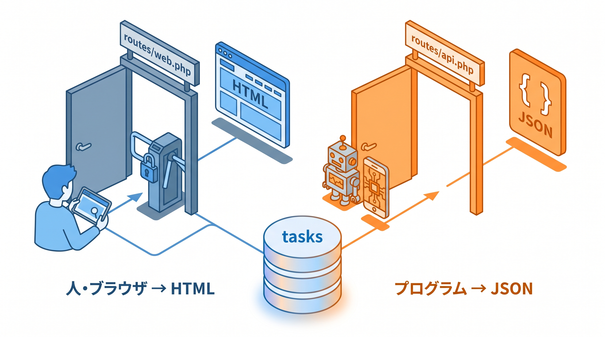

# 7-1 REST API とルート設計

📝 **前提知識**: このセクションは 2-2 Laravel 8 から 10 への変更点 の内容を前提としています。

Chapter 7 では、公開 REST API の基礎を扱います。これまで作ってきたのは画面（HTML）を返すアプリでしたが、ここからは外部のプログラムからデータを使える「入口」を設計・整形します。このセクションでは、その入口をどこにどう定義するか（ルート設計）を扱います。

| セクション | テーマ | 種類 |
|---|---|---|
| 7-1 REST API とルート設計 | API のルート設計と Web ルートとの違い | 概念 |
| 7-2 API Resource でレスポンスを整形する | レスポンスの JSON 整形 | 概念 |
| 7-3 API 開発ツール（Postman） | Postman での疎通確認 | 混合 |

📖 **この Chapter の進め方**: 7-1 で REST / JSON API の考え方と、`routes/api.php`・`apiResource`・バージョニング・CORS を理解して API ルートを設計します。続く 7-2 で、返す JSON の中身を `JsonResource` で整形する方法を学びます。最後に 7-3 で、作った API を確認するためのツール Postman をインストールし、リクエストの送り方を身につけます。

## 🎯 このセクションで学ぶこと

- REST / JSON API の考え方と、画面を返す Web アプリとの違いを理解する
- `routes/api.php` と `apiResource` で API のルートを設計する
- `Api\V1` 名前空間と `/v1` プレフィックスでバージョンを分け、Web と API のコントローラを分離する
- 暗黙のルートモデルバインディングと CORS を理解する

このセクションでは、API のルートを「どこに・どう・どんな URL で」定義するかを設計できるようになります。

💡 このセクションのコードやコマンドは、仕組みを理解するための例です。ここで手を動かす必要はありません。実際に書いて動かすのは、Chapter 8 末の 8-3 ハンズオンと Part 4 の総合ハンズオンです。

---

## 導入: 画面はあるのに、プログラムから使う入口がない

これまで作ってきたアプリは、ブラウザでアクセスすると HTML の画面が返ってきました。人が見るにはそれでよいのですが、スマートフォンアプリや別のサーバーのプログラムが「タスクの一覧データだけ欲しい」と思っても、HTML の中から欲しいデータを取り出すのは現実的ではありません。

プログラムから扱いやすいのは、画面ではなく **構造化されたデータ** です。そのために用意するのが API です。同じ「タスクの一覧」でも、Web ルートは HTML を返し、API は JSON を返します。利用者が違えば、返すもの・置き場所・約束ごとも変わります。このセクションでは、その「API 側」のルートをどう設計するかを学びます。

### 🧠 先輩エンジニアの思考プロセス

> 最初の API をうっかり `routes/web.php` に書いてしまい、外部ツールから叩くたびに 419（CSRF トークン不一致）で弾かれて、半日悩みました。API は `routes/api.php` に置けばセッションも CSRF チェックも通らない、と分かってからは、Web と API を最初から別物として設計するようになりました。同じ「タスク一覧」でも、置き場所を間違えると土台から噛み合いません。



---

## REST / JSON API とは何か

**API** は、プログラムどうしがやり取りするための窓口です。Web の世界では、URL に対して HTTP リクエスト（GET / POST など）を送ると、サーバーが JSON 形式のデータで応える、という形が広く使われます。これを **REST API** （あるいは JSON API）と呼びます。

REST の考え方では、URL は「操作」ではなく **リソース（データのまとまり）** を表します。タスクというリソースに対して、HTTP メソッドで「何をするか」を表す、という対応です。

| やりたいこと | HTTP メソッド | URL の例 |
|---|---|---|
| 一覧を取得 | GET | `/api/v1/tasks` |
| 1 件を取得 | GET | `/api/v1/tasks/1` |
| 新規作成 | POST | `/api/v1/tasks` |
| 更新 | PUT / PATCH | `/api/v1/tasks/1` |
| 削除 | DELETE | `/api/v1/tasks/1` |

URL を見ると、`tasks` というリソースが主語で、`GET` か `POST` かといったメソッドが動詞にあたります。「タスクを取得する URL」「タスクを作る URL」のように動詞を URL に埋め込むのではなく、**リソースを URL で、操作をメソッドで** 表すのが REST の基本です。

🔑 利用者の違いを押さえてください。Web ルートはブラウザで画面を見る人が利用者で、HTML を返します。API は、モバイルアプリ・フロントエンドのフレームワーク・外部サービスといった **プログラム** が利用者で、JSON を返します。

## Web ルートと API ルートの違い

Laravel では、ルートの定義ファイルが用途別に分かれています。画面を返すルートは `routes/web.php`、API のルートは `routes/api.php` に書きます。この 2 つは、ただファイルが違うだけではなく、適用される **ミドルウェアのグループ** が違います。

```php
// routes/api.php （API のルートはこちらに書く）
use App\Http\Controllers\Api\V1\TaskController;
use Illuminate\Support\Facades\Route;

Route::apiResource('tasks', TaskController::class);
```

`routes/api.php` に書いたルートには、Laravel が自動で 2 つのことをします。

- **`/api` プレフィックスが付く**: ファイルに `tasks` と書いても、実際の URL は `/api/tasks` になります。設定は `app/Providers/RouteServiceProvider.php` にあり、`routes/api.php` を `api` ミドルウェアと `/api` プレフィックス付きで読み込んでいます。
- **`api` ミドルウェアグループが適用される**: このグループには、セッションや CSRF 保護が **含まれません**。代わりにリクエスト数を制限する `throttle:api` などが入ります。

📝 Web ルート（`web` グループ）はセッションと CSRF 保護を使いますが、API はそうではありません。API は **ステートレス** （リクエストごとに独立し、サーバー側にログイン状態を保持しない）に設計するのが基本だからです。だからこそ、フォームの隠しトークン（CSRF トークン）を持たない外部プログラムからでも、API は叩けます。

## apiResource でルートをまとめて定義する

REST API のルートは、1 つのリソースについて「一覧・詳細・作成・更新・削除」の 5 つがセットになります。これを 1 行で定義できるのが `apiResource` です。

```php
// routes/api.php
Route::apiResource('tasks', TaskController::class);
```

この 1 行で、次の 5 つのルートがまとめて定義されます。

| メソッド | URL | コントローラのアクション | 役割 |
|---|---|---|---|
| GET | `/api/tasks` | `index` | 一覧 |
| POST | `/api/tasks` | `store` | 作成 |
| GET | `/api/tasks/{task}` | `show` | 詳細 |
| PUT / PATCH | `/api/tasks/{task}` | `update` | 更新 |
| DELETE | `/api/tasks/{task}` | `destroy` | 削除 |

画面向けの `Route::resource` には、新規作成フォームを表示する `create` と編集フォームを表示する `edit` も含まれます。しかし API は HTML のフォームを返さないので、`apiResource` ではこの 2 つが省かれ、5 つだけになります。

コントローラも、API 用の形を `--api` オプションで生成できます。`create` / `edit` を持たない、5 アクションのコントローラができます。

```bash
# 5 アクションだけを持つ API コントローラを生成する
php artisan make:controller Api/V1/TaskController --api --model=Task
```

`--model=Task` を付けると、各アクションの引数に `Task` 型が付いた形で生成されます。この型宣言が、次の「暗黙のルートモデルバインディング」と組み合わさります。

### 暗黙のルートモデルバインディング

`show(Task $task)` のように、アクションの引数に **モデルの型** を宣言すると、Laravel は URL の `{task}` 部分の ID を使って、対応する `Task` を自動で 1 件取り出してくれます。これを **暗黙のルートモデルバインディング** と呼びます。

```php
// app/Http/Controllers/Api/V1/TaskController.php （抜粋）
public function show(Task $task)
{
    // /api/v1/tasks/1 なら、id=1 の Task が $task に入っている
    return new TaskResource($task);
}
```

自分で `Task::find($id)` を書く必要がなく、しかも該当する ID が存在しなければ、モデルが見つからないときの例外（`ModelNotFoundException`）が自動で投げられます。この仕組みは Web ルートでも API ルートでも同じです。存在しない ID にアクセスしたときの応答（API なら JSON の 404）をどう設計するかは、8-2 で扱います。

## バージョニングで API を分ける

API は、一度公開すると外部のプログラムがそれに依存します。後からレスポンスの形を変えると、利用側が動かなくなります。そこで、URL に **バージョン** を持たせ、`/api/v1/...` のように区切っておきます。将来作り直すときは `/api/v2/...` を別に用意すれば、`v1` を使い続けている利用者を壊さずに済みます。

バージョンは、`Route::prefix('v1')` でルートをグループにまとめて表します。

```php
// routes/api.php
use App\Http\Controllers\Api\V1\TaskController;
use Illuminate\Support\Facades\Route;

Route::prefix('v1')->group(function () {
    Route::apiResource('tasks', TaskController::class);
});
```

`routes/api.php` には自動で `/api` が付くので、`prefix('v1')` と合わせて、最終的な URL は `/api/v1/tasks` になります。

あわせて、コントローラの **置き場所（名前空間）** も分けます。画面向けのコントローラが `App\Http\Controllers\TaskController` だとすると、API 用は `App\Http\Controllers\Api\V1\TaskController` に置きます。ディレクトリでいうと `app/Http/Controllers/Api/V1/` です。

🔑 こうして「URL の `/v1`」と「名前空間の `Api\V1`」をそろえることで、同じ `tasks` でも Web 用と API 用のコントローラがはっきり分かれます。画面のコントローラと API のコントローラは役割が違う（HTML を返すか JSON を返すか）ので、最初から別の場所に置くのが見通しのよい設計です。

## CORS で別オリジンからのアクセスを許す

ブラウザには、安全のために「今見ているページと違うオリジン（ドメインやポートの組み合わせ）への通信を、既定では制限する」という仕組みがあります。たとえば `https://app.example.com` で動くフロントエンドから、`https://api.example.com` の API を呼ぶと、ブラウザがブロックすることがあります。これを越えるための約束ごとが **CORS** （Cross-Origin Resource Sharing）です。

Laravel 10 には CORS の仕組みが最初から組み込まれていて、設定は `config/cors.php` にあります。既定では、`api/*` のパスに対して CORS が有効になっています。

```php
// config/cors.php （抜粋）
'paths' => ['api/*', 'sanctum/csrf-cookie'],

'allowed_methods' => ['*'],

'allowed_origins' => ['*'],
```

`paths` が「どの URL に CORS を効かせるか」、`allowed_origins` が「どのオリジンからのアクセスを許すか」です。既定は `*`（すべて許可）で、公開 API として動作確認するぶんにはこのままで困りません。

⚠️ **注意**: `allowed_origins` を `*`（すべて許可）にするのは、誰でも使える公開 API だからこそ成り立ちます。特定のフロントエンドだけに使わせたい API では、ここを実際のドメインに絞るのが安全です。本教材で扱う公開 API では既定のままで進めます。

---

## ✨ まとめ

- REST API は、URL でリソース（`tasks`）を、HTTP メソッド（GET / POST / PUT / DELETE）で操作を表し、JSON でデータを返す
- API のルートは `routes/api.php` に書く。自動で `/api` プレフィックスと `api` ミドルウェアグループが付き、Web と違ってセッション・CSRF を使わないステートレスな設計になる
- `apiResource` は一覧・作成・詳細・更新・削除の 5 ルートをまとめて定義する（フォーム用の `create` / `edit` は持たない）。`make:controller --api` で対応するコントローラを作る
- アクション引数にモデル型を宣言すると、URL の ID から自動でモデルを取り出す（暗黙のルートモデルバインディング）
- `Route::prefix('v1')` と `Api\V1` 名前空間でバージョンを分け、Web 用と API 用のコントローラを分離する
- CORS は `config/cors.php` で設定し、既定で `api/*` に対して有効になっている

---

次のセクションでは、API が返す JSON の中身を整える方法を学びます。`JsonResource` と `ResourceCollection` を使って、フィールドの選択・リレーションのネスト・`whenLoaded`・集計値の整形・`data` / `meta` 構造を組み立て、モデルをそのまま返すのではなく、外部に見せたい形だけを返せるようにします。
