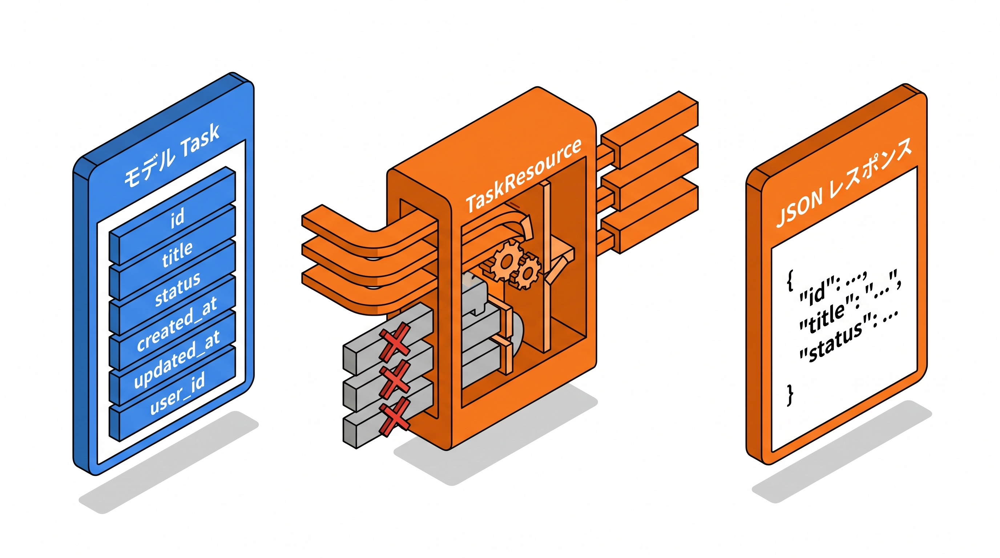

# 7-2 API Resource でレスポンスを整形する

📝 **前提知識**: このセクションは 7-1 REST API とルート設計 と 5-1 集計クエリとランキング の内容を前提としています。

## 🎯 このセクションで学ぶこと

- モデルをそのまま返すのではなく、API Resource で返す形を整える理由を理解する
- `JsonResource` の `toArray` でフィールドを選び、キー名を決める
- `whenLoaded` でリレーションを安全にネストする
- 集計値（件数・平均）を `(int)` や `round` で整形する
- 一覧を `data` / `meta` 付きのコレクションとして返す

このセクションでは、API が返す JSON の中身を、外部に見せたい形に整えられるようになります。

💡 このセクションのコードは、仕組みを理解するための例です。ここで手を動かす必要はありません。実際に書いて動かすのは、Chapter 8 末の 8-3 ハンズオンと Part 4 の総合ハンズオンです。

---

## 導入: モデルをそのまま返すと、内部構造が漏れる

API でタスクを返すだけなら、コントローラでモデルをそのまま JSON にして返すこともできます。

```php
// これでも JSON は返せるが…
return response()->json(Task::all());
```

ただ、これだとモデルの構造が **そのまま外部に出てしまいます**。`created_at` / `updated_at` のような内部的なタイムスタンプや、外部の利用者には不要な列まで、すべて見えてしまいます。さらに、後でテーブルに列を 1 つ足すと、API のレスポンスも黙って変わり、利用側のアプリが壊れることがあります。

そこで、モデルと最終的な JSON の間に **API Resource** を 1 枚はさみます。「どの列を、どんなキー名で、どんな構造で返すか」を 1 か所で決められるようにする仕組みです。

### 🧠 先輩エンジニアの思考プロセス

> モデルをそのまま `response()->json()` で返していたら、後でテーブルにカラムを 1 つ足しただけで、利用側の画面が崩れたことがあります。Resource を挟んでからは「返す形」を 1 か所で決められるので、内部のテーブル構造と、外部に見せる形を切り離して考えられるようになりました。テーブルは自由に育てて、見せる形は Resource で固定する、という分担です。



---

## API Resource とは

**API Resource** は、Eloquent モデルを JSON に変換するときの「通訳」です。モデルからどのデータを取り出し、どんなキー名で、どんな構造の JSON にするかを、Resource クラスの中に書きます。

`make:resource` で作ります。

```bash
php artisan make:resource Api/V1/TaskResource
```

`app/Http/Resources/Api/V1/TaskResource.php` ができ、`toArray` メソッドに「返す形」を書きます。

🔑 Resource を使う利点は 3 つです。返したくない列（内部のタイムスタンプなど）を **隠せる**、キー名や構造を **思いどおりに決められる**、そして整形ロジックが 1 か所に集まるので **テーブルの変更に強くなる**。API を作るときは Resource を通すのが基本の作法です。

## JsonResource でフィールドを選ぶ

`toArray` は、配列を返すメソッドです。`$this` を通してモデルのプロパティにアクセスし、返したいフィールドだけを並べます。

```php
// app/Http/Resources/Api/V1/TaskResource.php
namespace App\Http\Resources\Api\V1;

use Illuminate\Http\Resources\Json\JsonResource;

class TaskResource extends JsonResource
{
    public function toArray($request)
    {
        return [
            'id' => $this->id,
            'title' => $this->title,
            'status' => $this->status,
            'due_date' => $this->due_date,
            'description' => $this->description,
        ];
    }
}
```

ここに書いたキーだけが JSON に出ます。`created_at` を入れていないので、レスポンスには出ません。キー名も自由に変えられます（たとえばモデルの列が `due_date` でも、返すキーを `deadline` にできます）。

コントローラからは、モデルを Resource に包んで返します。

```php
// app/Http/Controllers/Api/V1/TaskController.php （抜粋）
public function show(Task $task)
{
    return new TaskResource($task);
}
```

📝 1 件を `new TaskResource($task)` で返すと、JSON は `{"data": {...}}` のように、自動で `data` というキーで包まれます。これは `JsonResource` の既定の動作です。「実際のタスクの中身が `data` の下に入る」と覚えておいてください。

## whenLoaded でリレーションを安全にネストする

タスクに紐づくカテゴリやタグも、レスポンスに含めたい場面があります。リレーション先も、それぞれ専用の Resource で整形し、ネスト（入れ子）にします。

```php
// app/Http/Resources/Api/V1/TaskResource.php
public function toArray($request)
{
    return [
        'id' => $this->id,
        'title' => $this->title,
        'status' => $this->status,
        'due_date' => $this->due_date,
        'category' => new CategoryResource($this->whenLoaded('category')),
        'tags' => TagResource::collection($this->whenLoaded('tags')),
        'description' => $this->description,
    ];
}
```

ここで使っている `whenLoaded` が重要です。`whenLoaded('tags')` は、**`tags` リレーションがあらかじめ読み込まれているときだけ** そのフィールドを含めます。読み込まれていなければ、`tags` キーごとレスポンスから外れます。

なぜこれが必要かというと、`whenLoaded` を使わずに `$this->tags` と書くと、リレーションが読み込まれていないときに Resource が変換のたびに 1 件ずつ問い合わせを発生させ、5-2 で扱った N+1 問題を引き起こすからです。`whenLoaded` を使えば、「コントローラで `with('tags')` などで読み込んだときだけ含める」と制御でき、読み込み忘れによる N+1 を避けられます。

🔑 単一のリレーションは `new CategoryResource(...)`、複数のリレーションは `TagResource::collection(...)` で包みます。どちらも中身は `whenLoaded` でくるみ、「読み込まれているときだけ出す」を徹底します。

## 集計値を整形する

5-1 で、`withCount` や `withAvg` を使うと、件数や平均がモデルに `{関連名}_count` / `{関連名}_avg_{列名}` という属性として添えられることを学びました。コントローラ側でこれらを集計しておけば、Resource はその値を整えて返すだけです。

たとえばタスクに「付いているタグの件数」を添えるなら、コントローラで `withCount('tags')` を呼び、Resource で `tags_count` を整形します。

```php
// TaskResource の toArray に追加する行
'tags_count' => (int) ($this->tags_count ?? 0),
```

ここで `(int)` を付けているのは、集計値がデータベースの都合で文字列として返ることがあるためです。`?? 0` は、集計対象が 0 件で値が入らなかったときに `0` にする保険です。件数は「0 件なら 0」が自然なので、こう整えます。

平均値の場合は、5-1 で確認したとおり、整え方が少し変わります。`withAvg` で求めた平均は小数の文字列で返り、しかも対象が 0 件だと `null` になります。そこで `round` で桁をそろえ、`null` のときはそのまま `null` を返します。たとえば「カテゴリごとのタスクの平均見積もり時間」を返す `CategoryResource` なら、次のようになります。

```php
// app/Http/Resources/Api/V1/CategoryResource.php （抜粋）
public function toArray($request)
{
    return [
        'id' => $this->id,
        'name' => $this->name,
        'tasks_count' => (int) ($this->tasks_count ?? 0),
        'average_minutes' => $this->tasks_avg_estimated_minutes !== null
            ? round((float) $this->tasks_avg_estimated_minutes, 1)
            : null,
    ];
}
```

🔑 件数（`withCount`）は `(int)` で整数にし、平均（`withAvg`）は `round((float) ..., 1)` で桁をそろえ、0 件で `null` のときは `null` のまま返す。集計値を API に出すときは、この整え方をそのまま使えます。

## 一覧を data / meta 付きのコレクションで返す

一覧 API では、複数のタスクをまとめて返します。Resource にはコレクション用の `collection` メソッドがあり、これにモデルの一覧を渡します。

```php
// app/Http/Controllers/Api/V1/TaskController.php （抜粋）
public function index()
{
    $tasks = Task::with(['category', 'tags'])->paginate(20);

    return TaskResource::collection($tasks);
}
```

`paginate(20)` でページ分けして取得したものを `TaskResource::collection($tasks)` に渡すと、Laravel が自動で次のような構造の JSON を組み立てます。

```json
{
  "data": [
    { "id": 1, "title": "...", "status": "...", "tags": [] }
  ],
  "links": {
    "first": "http://localhost/api/v1/tasks?page=1",
    "last": "http://localhost/api/v1/tasks?page=3",
    "prev": null,
    "next": "http://localhost/api/v1/tasks?page=2"
  },
  "meta": {
    "current_page": 1,
    "from": 1,
    "last_page": 3,
    "path": "http://localhost/api/v1/tasks",
    "per_page": 20,
    "to": 20,
    "total": 50
  }
}
```

`data` に各タスク（`TaskResource` で整形済み）が並び、`links` にページ移動用の URL、`meta` にページネーションの情報（現在のページ・全ページ数・1 ページあたりの件数・総件数）が入ります。上の `meta` は主要なキーを抜粋したもので、実際にはこのほかに各ページ番号へのリンクを並べた配列も含まれます。

📝 `data` / `links` / `meta` は、ページネーションした結果を `collection` に渡すだけで自動で付きます。専用のコレクションクラスを別に作る必要はありません。利用側は `meta.total` で総件数を、`meta.last_page` で最終ページを知って、次のページを取りにいけます。

---

## ✨ まとめ

- API Resource は、モデルと JSON の間の「通訳」。返す列・キー名・構造を 1 か所で決め、内部のテーブル構造を外部から切り離す
- `make:resource` で作り、`toArray` に返したいフィールドだけを並べる。書かなかった列（`created_at` など）は出ない
- リレーションは `whenLoaded` でくるみ、読み込まれているときだけ含める。これで N+1 を避けられる（単一は `new XxxResource(...)`、複数は `XxxResource::collection(...)`）
- 集計値は、件数を `(int)`、平均を `round((float) ..., 1)` で整形し、0 件の `null` はそのまま返す
- 一覧は `Resource::collection($paginator)` で返すと、`data` / `links` / `meta` が自動で付く（専用コレクションクラスは不要）

---

次のセクションでは、ここまで設計・整形してきた API を、実際に試すためのツールを扱います。API テストツール Postman をインストールし、GET / POST などのリクエストの送り方、`Accept: application/json` ヘッダーや JSON ボディの設定、コレクションと環境変数によるリクエストの整理を学んで、2-3 のサンドボックスに用意した API へ疎通確認できるようになります。
