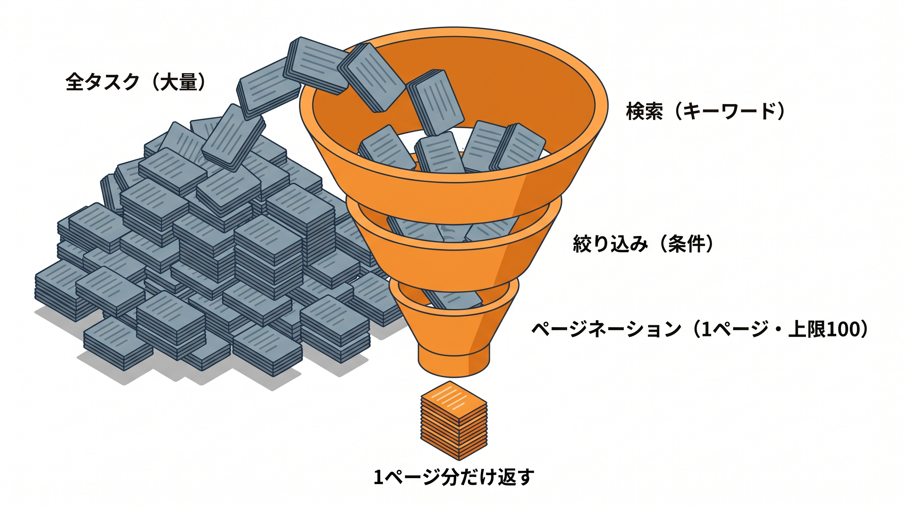

# 8-1 検索・絞り込み・ページネーション

📝 **前提知識**: このセクションは 7-2 API Resource でレスポンスを整形する の内容を前提としています。

Chapter 8 では、一覧 API を実用的にする要素と、エラーの設計を扱います。検索・絞り込み・ページネーションで一覧を扱いやすくし、HTTP ステータスと JSON 例外で異常時の応答を整え、最後にスターターキットへ公開 API を実装します。

| セクション | テーマ | 種類 |
|---|---|---|
| 8-1 検索・絞り込み・ページネーション | 動的なクエリとページ分け | 概念 |
| 8-2 エラー設計と JSON 例外 | HTTP ステータスと例外の JSON 化 | 概念 |
| 8-3 ハンズオン: 公開タスク API を実装する | 公開 API をゼロから実装 | ハンズオン |

📖 **この Chapter の進め方**: 8-1 で一覧 API に検索・絞り込み・ページネーションを備え、8-2 で HTTP ステータスと JSON 例外を設計します。最後に 8-3 で、スターターキットに公開タスク API を実装し、Chapter 7〜8 の内容を通して使います。

## 🎯 このセクションで学ぶこと

- クエリパラメータの有無で、検索条件を動的に組み立てる（`when` / `filled`）
- LIKE によるキーワード検索と、`whereHas` による関連での絞り込みを実装する
- `paginate` でページ分けし、`per_page` の指定・デフォルト値・上限クランプを扱う

このセクションでは、一覧 API に検索・絞り込み・ページネーションを備えられるようになります。

💡 このセクションのコードは、仕組みを理解するための例です。ここで手を動かす必要はありません。実際に書いて動かすのは、次の 8-3 ハンズオンと Part 4 の総合ハンズオンです。

---

## 導入: 全件返す一覧 API は、いずれ破綻する

一覧 API を素朴に作ると、`Task::all()` のようにすべてのタスクを返してしまいがちです。データが少ないうちは問題ありませんが、件数が増えると、1 回のリクエストで数千・数万件を返すことになり、応答が重くなったり、最悪タイムアウトします。

実用的な一覧 API には、3 つの要素が要ります。**検索** （キーワードで探す）・**絞り込み** （条件で絞る）・**ページネーション** （一度に返す件数を区切る）です。しかも、これらは「指定されたときだけ」効くようにしなければなりません。キーワードが空なら全件が対象、指定されればその条件で絞る、という具合に、クエリを **動的に** 組み立てます。

### 🧠 先輩エンジニアの思考プロセス

> 件数を区切らない一覧 API を出したら、データが育った本番環境で一覧がタイムアウトしました。最初から `paginate` と件数の上限を入れておけば防げた失敗です。それ以来「一覧 API は、まずページネーションと 1 ページの上限から設計する」を口ぐせにしています。検索や絞り込みは後から足せますが、件数の制御は最初に決めておくものだと考えています。



---

## クエリパラメータで動的にクエリを組み立てる

検索条件は、URL のクエリパラメータで受け取ります。`/api/v1/tasks?keyword=報告&status=pending` のような形です。これらは「指定されることもあれば、されないこともある」ので、パラメータがあるときだけ条件を足す、という組み立て方をします。

基本は、クエリビルダを変数に持っておき、条件があるときだけ `where` を足していく形です。「指定されたか」の判定には `filled` を使います。

```php
// パラメータがあるときだけ条件を足す
$query = Task::query();

if ($request->filled('keyword')) {
    $keyword = $request->input('keyword');
    $query->where('title', 'like', "%{$keyword}%");
}

$tasks = $query->paginate(20);
```

`$request->filled('keyword')` は、`keyword` が **存在し、かつ空でない** ときに `true` を返します。`?keyword=`（値が空）のときは `false` になるので、空のキーワードで誤って絞り込むことを防げます。

🔑 ポイントは、クエリビルダを段階的に組み立てることです。`Task::query()` で土台を作り、条件があるものだけ `where` を重ね、最後に `paginate` で実行します。条件の有無に応じて、組み立てるクエリが変わります。

同じことを、より簡潔に書ける `when` メソッドもあります。`when` は、第 1 引数が `true` のときだけ、第 2 引数のクロージャを実行します。

```php
// when を使うと、if のネストを減らせる
$tasks = Task::query()
    ->when($request->filled('keyword'), function ($query) use ($request) {
        $keyword = $request->input('keyword');
        $query->where('title', 'like', "%{$keyword}%");
    })
    ->paginate(20);
```

どちらでも結果は同じです。本教材では、読みやすさを優先して `if ($request->filled(...))` の形を主に使いますが、`when` も同じ考え方だと押さえておいてください。

## キーワード検索（LIKE）と関連での絞り込み（whereHas）

**キーワード検索** は、SQL の `LIKE` で部分一致を見ます。`"%{$keyword}%"` のように前後を `%` で囲むと、「キーワードを含む」という意味になります。複数の列（タイトルと説明など）を「どちらかに含む」で探すときは、`orWhere` をクロージャでまとめます。

```php
if ($request->filled('keyword')) {
    $keyword = $request->input('keyword');
    $query->where(function ($q) use ($keyword) {
        $q->where('title', 'like', "%{$keyword}%")
            ->orWhere('description', 'like', "%{$keyword}%");
    });
}
```

ここでクロージャ `function ($q) { ... }` で囲んでいるのは、`title LIKE ... OR description LIKE ...` という条件を **1 つのまとまり** にするためです。囲まないと、後ろに足す他の条件と `OR` が混ざり、意図しない絞り込みになります。

**関連での絞り込み** は、5-1 で学んだ `whereHas` を使います。「指定したタグが付いているタスクだけ」のように、関連先の条件で絞ります。

```php
if ($request->filled('tag_id')) {
    $tagId = $request->input('tag_id');
    $query->whereHas('tags', function ($q) use ($tagId) {
        $q->where('tags.id', $tagId);
    });
}
```

これで、`?keyword=報告&tag_id=3` のように複数のパラメータが来ても、それぞれの `if` が独立して条件を足すので、組み合わせた絞り込みができます。

## ページネーション

ページネーションは、`paginate` で行います。`paginate(20)` なら 1 ページ 20 件で区切り、`?page=2` のようなクエリパラメータで何ページ目かを受け取ります。

```php
$tasks = $query->latest()->paginate(20);

return TaskResource::collection($tasks);
```

`latest()` は作成日時の新しい順に並べる指定です。`paginate` した結果を `TaskResource::collection` に渡すと、7-2 で見たとおり `data` / `links` / `meta` の構造で返り、`meta` に現在のページ・全ページ数・総件数が入ります。利用側はこの `meta` を見て、次のページを取りにいけます。

## per_page の指定・デフォルト・上限クランプ

1 ページの件数を、利用側が `?per_page=50` のように指定できると便利です。これを受け取って `paginate` に渡しますが、3 つの配慮が要ります。

- **デフォルト値**: 指定がなければ既定の件数（ここでは 20）にする
- **上限クランプ**: 大きすぎる値を防ぐため、上限（ここでは 100）を超えたら 100 に丸める
- **不正値の検証**: 整数でない・1 未満などの値は受け付けない（検証は後述）

デフォルトと上限クランプは、次のように書きます。

```php
$perPage = (int) $request->input('per_page', 20); // 指定がなければ 20
$perPage = min($perPage, 100);                     // 上限 100 に丸める（クランプ）

$tasks = $query->latest()->paginate($perPage);
```

`$request->input('per_page', 20)` は、`per_page` がなければ第 2 引数の `20` を返します。`min($perPage, 100)` は、`$perPage` が 100 を超えていれば 100 に、そうでなければそのままにします。これが **上限クランプ** です。

🔑 上限クランプがないと、利用側が `?per_page=100000` のように巨大な値を送れてしまい、1 回のリクエストで全件を読み込ませることができてしまいます。これはページネーションを入れた意味を失わせます。「大きすぎる指定は黙って上限に丸める」ことで、ページネーションの効果を守ります。

不正な値（整数でない、1 未満、など）は、専用の FormRequest で検証します。一覧 API でも、クエリパラメータをバリデーションできます。

```php
// app/Http/Requests/Api/V1/IndexTaskRequest.php
namespace App\Http\Requests\Api\V1;

use Illuminate\Foundation\Http\FormRequest;

class IndexTaskRequest extends FormRequest
{
    public function authorize()
    {
        return true;
    }

    public function rules()
    {
        return [
            'keyword' => ['nullable', 'string', 'max:255'],
            'tag_id' => ['nullable', 'integer', 'exists:tags,id'],
            'page' => ['nullable', 'integer', 'min:1'],
            'per_page' => ['nullable', 'integer', 'min:1'],
        ];
    }
}
```

`nullable` は「指定されなくてもよい」を表します。`per_page` は `min:1`（1 以上）だけを検証し、上限はクランプ側で吸収します。`tag_id` の `exists:tags,id` は、存在しないタグ ID を弾く検証です。これらの検証に引っかかったとき API が何を返すか（ステータス 422 と JSON のエラー）は、次のセクションで扱います。

---

## ✨ まとめ

- 一覧 API は全件返さず、検索・絞り込み・ページネーションで扱える形にする
- クエリは動的に組み立てる。`$request->filled(...)` で「指定され、空でない」ときだけ条件を足す（`when` でも同じことができる）
- キーワード検索は `LIKE` と `"%...%"`、複数列は `orWhere` をクロージャでまとめる。関連での絞り込みは `whereHas`
- ページネーションは `paginate`。結果を `Resource::collection` に渡すと `data` / `meta` が付く
- `per_page` はデフォルト値（`input('per_page', 20)`）と上限クランプ（`min($perPage, 100)`）で扱い、不正値は `IndexTaskRequest` で検証する

---

次のセクションでは、API のエラーをどう設計するかを扱います。操作の結果を HTTP ステータスコード（200 / 201 / 204 / 404 / 422）で適切に伝え、`Handler` で API 向けに例外を JSON に変換します。モデルが見つからない `ModelNotFoundException` を 404 の JSON に、バリデーションの失敗を 422 の JSON にして、異常時も「API は常に JSON を返す」を守れるようにします。
