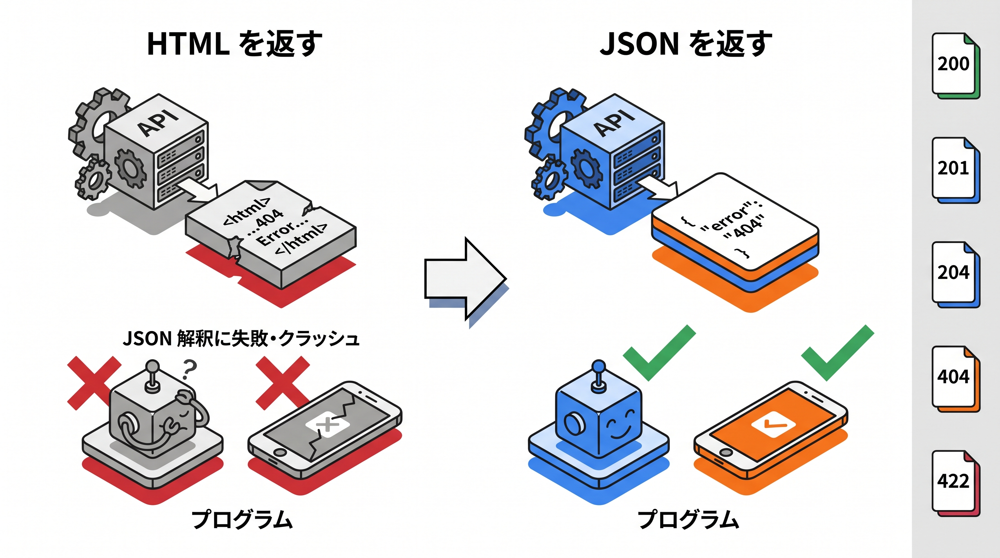

# 8-2 エラー設計と JSON 例外

📝 **前提知識**: このセクションは 8-1 検索・絞り込み・ページネーション の内容を前提としています。

## 🎯 このセクションで学ぶこと

- 操作の結果を HTTP ステータスコード（200 / 201 / 204 / 404 / 422）で適切に伝える
- 作成は 201、削除は 204（本文なし）で返す
- バリデーション失敗が 422 の JSON で返ることを理解する
- `Handler` の `render` で、見つからない例外を JSON の 404 に変換する

このセクションでは、API の正常・異常の応答を、ステータスコードと JSON で適切に設計できるようになります。

💡 このセクションのコードは、仕組みを理解するための例です。ここで手を動かす必要はありません。実際に書いて動かすのは、次の 8-3 ハンズオンと Part 4 の総合ハンズオンです。

---

## 導入: API が HTML のエラーページを返すと、利用側が困る

画面を返すアプリでは、エラーが起きると HTML のエラーページ（404 ページなど）を表示すれば済みました。しかし API の利用者はプログラムです。プログラムは JSON を期待しているので、異常時にいきなり HTML が返ってくると、JSON として解釈できずにクラッシュします。

API では、**正常時も異常時も JSON で応える** ことと、**結果を HTTP ステータスコードで正しく伝える** ことの 2 つが要ります。「作成できた」「見つからなかった」「入力が不正だった」を、利用側が機械的に判断できるよう、ステータスコードで区別します。

### 🧠 先輩エンジニアの思考プロセス

> 存在しない ID を叩いたとき、API が HTML のエラーページを返していて、利用側のアプリが JSON のパースに失敗してクラッシュしたことがあります。原因の調査に時間を取られた末が「API なのに HTML を返していた」では、報われません。`Handler` で `api/*` のときだけ JSON を返すようにしてからは、異常時も含めて「API は常に JSON」を守れるようになりました。



---

## HTTP ステータスコードで結果を伝える

HTTP ステータスコードは、リクエストの結果を表す 3 桁の数字です。利用側は、まずこの番号を見て成否を判断します。公開 API でよく使うものを整理します。

| ステータス | 意味 | 主な場面 |
|---|---|---|
| 200 OK | 成功 | 一覧・詳細・更新 |
| 201 Created | 作成された | 新規作成（POST） |
| 204 No Content | 成功・本文なし | 削除 |
| 404 Not Found | 見つからない | 存在しない ID へのアクセス |
| 422 Unprocessable Entity | 検証できない | バリデーション失敗 |

200 番台は成功、400 番台は「リクエスト側の問題」を表します。同じ「成功」でも、新規作成は 201、削除は 204、と区別するのが REST の作法です。利用側は「201 が返ったから作成された」「404 だから対象がない」と、番号だけで分岐を組めます。

🔑 ステータスコードは、レスポンス本文とは別の「結果の見出し」です。本文の中に `"success": true` のような値を入れるより、ステータスコードで成否を表すほうが、HTTP の標準に沿っていて利用側も扱いやすくなります。

## 成功を正しいステータスで返す

一覧・詳細・更新は、Resource をそのまま返せば 200 になります。一方、作成（201）と削除（204）は、明示的にステータスを指定します。

**作成は 201**。Resource を返すときに `response()->setStatusCode(201)` でステータスを差し替えます。

```php
// app/Http/Controllers/Api/V1/TaskController.php （抜粋）
public function store(StoreTaskRequest $request)
{
    $task = Task::create($request->validated());

    return (new TaskResource($task))
        ->response()
        ->setStatusCode(201);
}
```

`new TaskResource($task)` だけだと 200 で返るので、`->response()->setStatusCode(201)` を足して「作成された」を表す 201 にします。本文には作成したタスクを返します。

**削除は 204**。削除は「成功したが、返す本文はない」ので、本文を `null`、ステータスを 204 にします。

```php
public function destroy(Task $task)
{
    $task->delete();

    return response()->json(null, 204);
}
```

⚠️ **注意**: 204 はレスポンス本文を持たないステータスです。`curl` でふつうに叩くと画面に何も表示されず、成功したのか不安になります。ステータスコードを目で見るには `curl -i`（レスポンスヘッダーを表示）を使い、`HTTP/1.1 204 No Content` の行を確認します。動作確認の方法は 8-3 で扱います。

## バリデーション失敗は 422

8-1 で作った `IndexTaskRequest` や、作成・更新用の FormRequest で検証に失敗したとき、API は **422** を返します。ここがうれしいところで、API（JSON を期待するリクエスト）に対しては、Laravel が **自動で** 422 の JSON を返してくれます。コントローラ側で例外処理を書く必要はありません。

返る JSON は、`message`（概要）と `errors`（項目ごとのエラー）の形です。

```json
{
  "message": "タスク名は必須です。 (and 1 more error)",
  "errors": {
    "title": ["タスク名は必須です。"],
    "status": ["ステータスには pending、in_progress、completed のいずれかを指定してください。"]
  }
}
```

`errors` のキーが項目名、値がその項目のエラーメッセージの配列です。日本語のメッセージは、FormRequest の `messages()` で定義したものがそのまま出ます。利用側は `errors` を見て、どの項目が不正だったかを画面に出せます。

📝 この 422 の JSON は、リクエストが「JSON を期待している」とき、つまり `Accept: application/json` ヘッダーが付いているときに返ります。これがないと、検証失敗時には JSON ではなくリダイレクトが返ります（URL が `api/*` でも同じです）。API の利用側は `Accept: application/json` を付けてリクエストするのが基本です。

## 見つからないときは Handler で JSON の 404 を返す

7-1 で見たとおり、`show(Task $task)` のような暗黙のルートモデルバインディングでは、URL の ID に対応するタスクが無いと `ModelNotFoundException` が投げられます。このとき Laravel が既定で返す JSON は、開発環境では `No query results for model [App\Models\Task] 1` のように **内部のクラス名が漏れた素っ気ないメッセージ** です（本番環境ではこの詳細は隠されます）。

公開 API としては、`{"error": "タスクが見つかりませんでした。"}` のような統一された親切なメッセージを返したいところです。こうしたアプリ全体に関わる例外処理は、`app/Exceptions/Handler.php` の `render` メソッドで上書きします。

```php
// app/Exceptions/Handler.php
namespace App\Exceptions;

use Illuminate\Database\Eloquent\ModelNotFoundException;
use Illuminate\Foundation\Exceptions\Handler as ExceptionHandler;
use Throwable;

class Handler extends ExceptionHandler
{
    public function register(): void
    {
        $this->reportable(function (Throwable $e) {
            //
        });
    }

    public function render($request, Throwable $e)
    {
        if ($request->is('api/*') && $e instanceof ModelNotFoundException) {
            return response()->json([
                'error' => 'タスクが見つかりませんでした。',
            ], 404);
        }

        return parent::render($request, $e);
    }
}
```

ポイントは 2 つです。

- **`$request->is('api/*')`**: URL が `api/` で始まるリクエスト、つまり API リクエストのときだけ、このカスタム処理を行います。Web 画面のエラー処理（HTML のエラーページ）には影響しません。
- **`$e instanceof ModelNotFoundException`**: 暗黙のルートモデルバインディングでモデルが見つからなかったときの例外だけを、JSON の 404 に変換します。それ以外の例外は `parent::render(...)` に渡し、Laravel の既定の処理に任せます。

🔑 こうしておくと、`GET /api/v1/tasks/99999`（存在しない ID）のような要求に対して、HTML ではなく `{"error": "タスクが見つかりませんでした。"}` と 404 が返ります。バリデーション（422）は自動、見つからない（404）は `Handler` で、というように、API の異常応答を JSON にそろえられます。

---

## ✨ まとめ

- API は、正常時も異常時も JSON で応え、結果を HTTP ステータスコードで伝える
- 成功でも区別する。一覧・詳細・更新は 200、新規作成は 201（`setStatusCode(201)`）、削除は 204（`response()->json(null, 204)`）
- バリデーション失敗は、JSON を期待するリクエストに対して自動で 422 が返る。本文は `message` と `errors`（項目ごと）で、メッセージは FormRequest の `messages()` がそのまま出る
- 見つからない例外は、`Handler` の `render` で `$request->is('api/*')` と `ModelNotFoundException` を見て、JSON の 404 に変換する

---

次のセクションは、Chapter 7〜8 の総まとめとなるハンズオンです。スターターキット `laravel-api-starter` をクローンし、公開 REST API を一から実装します。`Api\V1` 名前空間のコントローラと API 用 FormRequest、API Resource、検索・ページネーション付きの一覧、詳細・登録・更新・削除、JSON 例外、`per_page` の上限クランプを、ここまで学んだ内容を通して組み上げます。
