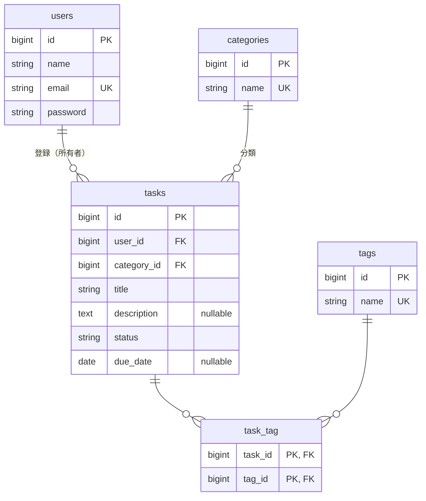

# 9-1 要件定義と設計

📝 **前提知識**: このセクションは 1-1 この教材の全体像と進め方 の内容を前提としています。

Part 4 では、ここまで学んだ技術をすべて 1 つのアプリに統合します。タスク管理アプリをゼロから Laravel 10 + Sail で構築し、多対多リレーション・Policy 認可・集計・公開 REST API・自動テストを通して実装します。

| セクション | テーマ | 種類 |
|---|---|---|
| 9-1 要件定義と設計 | 要件を読み解き、ER 図・テーブル・画面/API を設計する | ハンズオン（設計中心） |
| 9-2 環境構築と提供 Blade アセットの配置 | Sail でプロジェクトを作り、画面一式を配置する | ハンズオン |
| 9-3 マイグレーションとモデル（リレーション定義） | テーブルとモデルを作る | ハンズオン |
| 9-4 認証（Fortify） | 登録・ログインを実装する | ハンズオン |
| 9-5 CRUD（カテゴリ・タスク）と多対多操作 | CRUD とタグ付けを実装する | ハンズオン |

📖 **この Chapter の進め方**: 9-1 でアプリの要件を読み解き、ER 図とテーブルを設計します。9-2 で Sail と画面アセットを用意し、9-3 でテーブルとモデル、9-4 で認証、9-5 で CRUD と多対多操作を実装して、認証付きのタスク管理アプリを動く状態まで仕上げます。続く Chapter 10 で、認可・集計・公開 API・自動テストを積み上げます。

> 🔑 **この総合ハンズオンは、最初から順にコマンドとコードをそのままコピー＆ペーストすれば、アプリが完成するように書いてあります。** 各セクションの末尾でアプリはビルド・実行できる状態になり、次のセクションがその続きを積み上げます。コマンドは実行する場所（カレントディレクトリ）を毎回示し、新しいファイルは `mkdir` / `touch` で作成してから内容を載せ、書き換えるファイルは原則として全体を載せます。上から順に進めてください。9-1 は設計のセクションなので、手を動かすコードはまだありません。実際の構築は 9-2 から始まります。

## 🎯 このセクションで学ぶこと

- タスク管理アプリの要件を読み解き、あいまいな部分を設計上の判断に落とし込む
- ER 図とテーブル定義を設計する（1 対多・多対多・外部キー）
- 画面（Web）と公開 API のエンドポイント、バリデーションの方針を決める

このセクションでは、これから作るアプリの全体像を、要件・データ構造・画面/API の 3 つの面から設計します。

📝 **このセクションで活かす概念**: 既習のリレーショナル DB 設計・正規化・ER 図を、本アプリのデータ構造に適用します。多対多のピボット設計（3-1）も設計判断として使います。

---

## 導入: 要件には「書かれていないこと」がある

新しい模擬案件では、要件を読み解いて自分で設計に落とす力が問われます。要件には、はっきり書かれていることと、行間に隠れていることがあります。「タスクを分類したい」という一文からは、分類が 1 つだけなのか複数なのか、分類は誰でも編集してよいのかが読み取れません。ここを設計者が決めないと、テーブルもリレーションも定まりません。

このセクションでは、タスク管理アプリの短い要件から、ER 図・テーブル・画面/API を設計します。コードはまだ書きません。設計を固めてから、9-2 以降で実装します。

### 🧠 先輩エンジニアの思考プロセス

> 要件を読んでいて一番神経を使うのは、「複数か、1 つか」「誰のものか」「消したらどうなるか」の 3 点です。タグのように複数付くものを 1 対多で作ってしまうと、後から作り直しになります。最初に多重度と所有者と削除の連鎖だけは紙に書き出して確かめてから、テーブルに起こすようにしています。

---

## 要件を読み解く

今回作るアプリの要件は、次のとおりです。

> ユーザーは、登録・ログインして、タスクを管理できる。各タスクには、タイトル・説明・状態（未着手 / 進行中 / 完了）・期限を持たせ、1 つのカテゴリ（仕事・プライベートなど）に分類する。タスクには複数のタグ（緊急・重要など）を自由に付けられる。タスクを編集・削除できるのは、登録した本人だけとする。タスクの一覧・詳細は、外部のプログラムからも使える公開 API としても提供する。

この文には、設計者が決めるべき「行間」がいくつもあります。読み解いて判断していきます。

- **カテゴリは 1 つか、複数か**: 「1 つのカテゴリに分類する」とあるので、タスクとカテゴリは **1 対多** （1 タスクは 1 カテゴリ、1 カテゴリに複数タスク）です。外部キー `category_id` をタスク側に持たせます。
- **タグは 1 つか、複数か**: 「複数のタグを自由に付けられる」とあり、1 つのタグも複数のタスクに付きます。両方が「多」なので、タスクとタグは **多対多** です。3-1 で学んだピボットテーブルが必要になります。
- **編集・削除できるのは誰か**: 「登録した本人だけ」とあるので、タスクには **所有者** （`user_id`）が必要で、編集・削除には所有者かどうかの **認可** が要ります（Chapter 10 で Policy として実装）。
- **カテゴリを消したらどうなるか**: 要件には明示されていませんが、タスクが紐づくカテゴリをうっかり消すと、タスクの分類が失われます。ここは「**紐づくタスクがあるカテゴリは削除させない**」という削除ガードを設ける判断にします（9-5 で実装）。
- **状態と期限の扱い**: 状態は「未着手 / 進行中 / 完了」の 3 つに限定します。期限は「設定しないタスクもある」と考え、**任意（null を許す）** とします。

🔑 多対多は **タスクとタグの 1 か所** に現れました。タグ付けは「付いているか・いないか」だけを記録すれば足りるので、3-1 で学んだ 2 パターンのうち **純粋なピボット** （複合主キー）を選びます。もう一方の一意制約を持つピボット（`id` を持ち重複を `unique` で防ぐ形）も 3-1・3-2 で扱いましたが、本アプリで多対多が必要なのはタグ付けの 1 か所なので、ここでは純粋なピボットだけを使います。

## ER 図

読み解いた関係を ER 図にまとめます。`users`・`categories`・`tags`・`tasks` の 4 つの実体テーブルと、多対多を表す `task_tag` のピボットテーブルで構成します。

- `tasks` は `users`（所有者）と `categories`（分類）の両方に属する（`belongsTo` が 2 つ）。
- `task_tag` は `tasks` と `tags` を結ぶ純粋なピボット（複合主キー `task_id` + `tag_id`、`id` を持たない）。

## テーブル定義

ER 図を、列・型・制約のレベルまで具体化します。これが 9-3 でマイグレーションを書くときの設計図になります。各テーブルの列・型・制約は、次のとおりです。

**users** は、認証に使う Laravel 標準のユーザーテーブルです。

| 列 | 型 | 制約・備考 |
|---|---|---|
| `id` | bigint | 主キー |
| `name` | string | 名前 |
| `email` | string | 一意（ログインに使う） |
| `password` | string | ハッシュ化して保存 |
| `created_at` / `updated_at` | timestamp | 作成・更新日時 |

📝 `email_verified_at` や `remember_token` などの標準列も含みます。認証（Fortify）に必要な列は 9-4 で追加します。

**categories** は、タスクを分類するカテゴリのマスタテーブルです。

| 列 | 型 | 制約・備考 |
|---|---|---|
| `id` | bigint | 主キー |
| `name` | string | 一意（カテゴリ名の重複を禁止） |
| `created_at` / `updated_at` | timestamp | 作成・更新日時 |

**tags** は、タスクに付けるタグのマスタテーブルです。

| 列 | 型 | 制約・備考 |
|---|---|---|
| `id` | bigint | 主キー |
| `name` | string | 一意（タグ名の重複を禁止） |
| `created_at` / `updated_at` | timestamp | 作成・更新日時 |

**tasks** は、このアプリの中心となるテーブルです。所有者（`user_id`）と分類（`category_id`）への外部キーを持ちます。

| 列 | 型 | 制約・備考 |
|---|---|---|
| `id` | bigint | 主キー |
| `user_id` | bigint | 外部キー（`users.id` を参照）。所有者。ON DELETE CASCADE |
| `category_id` | bigint | 外部キー（`categories.id` を参照）。削除はガードで防ぐ（既定の RESTRICT） |
| `title` | string | タイトル（必須） |
| `description` | text | 説明（null 可） |
| `status` | string | 状態。`pending` / `in_progress` / `completed`。既定値は `pending` |
| `due_date` | date | 期限（null 可） |
| `created_at` / `updated_at` | timestamp | 作成・更新日時 |

**task_tag** は、タスクとタグを結ぶ純粋なピボットテーブルです。`id` と `timestamps` を持たず、2 列の組を複合主キーにします。

| 列 | 型 | 制約・備考 |
|---|---|---|
| `task_id` | bigint | 外部キー（`tasks.id` を参照）。ON DELETE CASCADE |
| `tag_id` | bigint | 外部キー（`tags.id` を参照）。ON DELETE CASCADE |

この 2 列に複合主キー `primary(['task_id', 'tag_id'])` を設定し、同じタスクに同じタグが二重に付くことを防ぎます。

🔑 外部キーの **カスケード削除** は、ピボットと所有関係に効かせます。タスクを削除したら、そのタスクへのタグ付け（`task_tag`）も自動で消えるようにします。一方で `tasks.category_id` はカスケードにせず、「タスクのあるカテゴリは削除させない」ガードで守ります。データの整合性を、データベースの制約（カスケード）とアプリ側のガードの両方で保ちます。

📝 状態（`status`）は `pending` / `in_progress` / `completed` の 3 値に限定します。データベース上は文字列の列として持ち、入力時にバリデーション（`in:pending,in_progress,completed`）で 3 値以外を弾きます。画面では「未着手 / 進行中 / 完了」と日本語で表示します。

## 画面と公開 API の設計

このアプリは、人が使う **画面（Web）** と、プログラムが使う **公開 API** の 2 つの入口を持ちます。7-1 で整理したとおり、同じ「タスク」でも、画面は HTML を、API は JSON を返します。

画面（Web）側の主な機能は次のとおりです。すべてログイン必須とし、未ログインの場合はログイン画面に誘導します。

| 機能 | 画面 |
|---|---|
| 認証 | 登録・ログイン・ログアウト |
| カテゴリ | 一覧（タスク件数つき）・作成・編集・削除（ガードつき） |
| タスク | 一覧・詳細・作成・編集・削除 |
| タグ付け | タスクの作成・編集画面で複数選択 |
| ランキング | よく使われているタグの多い順 |

公開 API 側は、タスクのリソースに対する 5 つのエンドポイントを `/api/v1` 以下に置きます（7-1 のルート設計に従います）。

| メソッド | パス | 役割 |
|---|---|---|
| GET | `/api/v1/tasks` | 一覧（検索・絞り込み・ページネーション） |
| GET | `/api/v1/tasks/{task}` | 詳細 |
| POST | `/api/v1/tasks` | 登録 |
| PUT / PATCH | `/api/v1/tasks/{task}` | 更新 |
| DELETE | `/api/v1/tasks/{task}` | 削除 |

## バリデーションの方針

入力の検証は、Web・API ともに FormRequest で行います（既習）。主な方針を決めておきます。

- **タスク**: `title` は必須・255 文字以内。`status` は 3 値のいずれか（`in`）。`due_date` は任意・日付形式。`category_id` は必須で、存在するカテゴリ（`exists:categories,id`）。`tags` は任意の配列で、各要素は存在するタグ（`tags.*` に `exists:tags,id`）。
- **カテゴリ**: `name` は必須・255 文字以内・一意（`unique:categories,name`）。更新時は自分自身を除外する（`Rule::unique()->ignore()`）。
- **公開 API のタスク**: 認証を持たない公開 API なので、登録・更新では誰のタスクかを `user_id`（必須・`exists:users,id`）で受け取ります。一覧の `per_page` は 1 以上・100 以下（`max:100`）に制限します。

これらの具体的な書き方は、Web 側を 9-5、API 側を 10-3 で実装します。

---

## ✅ 設計の確認

このセクションは設計が成果物です。次を自分の言葉で説明・決定できれば、設計が固まっています。

- [ ] 要件のあいまいな点（カテゴリの多重度・タグの多重度・編集権限・カテゴリ削除時の扱い）を、設計上の判断として説明できる
- [ ] 4 つの実体テーブルと 1 つのピボットテーブルからなる ER 図を説明できる
- [ ] タスクとタグの多対多を、純粋なピボット（`task_tag`）で表す理由を説明できる
- [ ] カスケード削除を効かせる箇所と、削除ガードで守る箇所を区別できる
- [ ] 画面（Web）と公開 API のエンドポイント、バリデーションの方針を決められた

---

## ✨ まとめ

- 要件には「行間」がある。多重度（1 対多か多対多か）・所有者・削除の連鎖を読み解いて、設計上の判断に落とす
- タスク管理アプリは、`users`・`categories`・`tags`・`tasks` の 4 実体と、`task_tag`（純粋なピボット）の 1 ピボットで構成する
- カスケード削除（ピボット・所有関係）と削除ガード（カテゴリ）を使い分け、整合性を保つ
- 画面（HTML）と公開 API（JSON）の 2 つの入口を設計し、バリデーションは FormRequest で行う

---

次のセクションでは、ここで設計したアプリの土台を作ります。Sail で Laravel 10 のプロジェクトを新規作成し、phpMyAdmin と日本語ロケール（`locale=ja` と `lang/ja` の言語ファイル）を設定します。そのうえで、提供する Blade アセット一式をコピー＆ペーストで配置し、`@vite` で画面が表示されることを確認します。
