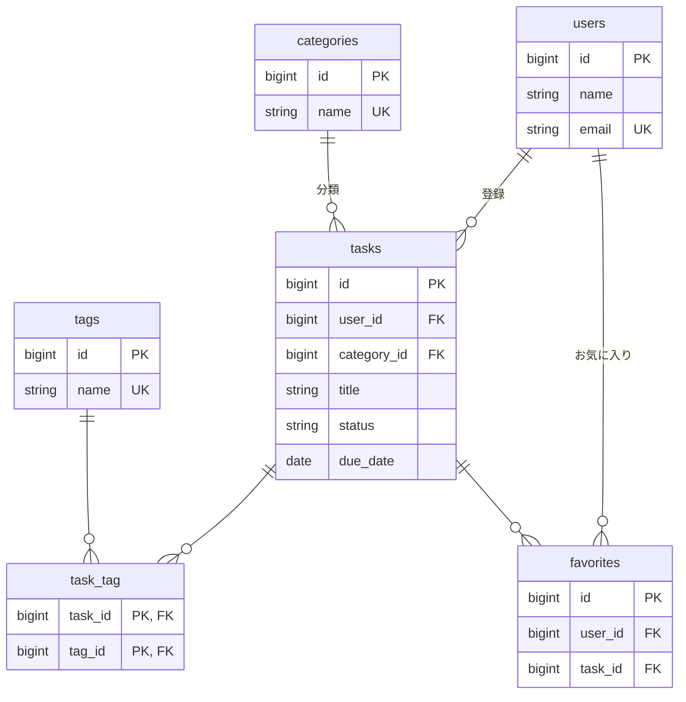

# 10-5 仕上げ（Pint・README・Issue 駆動の振り返り・提出前チェック）

📝 **このセクションで使うツール・活かす概念**: Laravel Pint（コード整形）、README、Git / GitHub の Issue・Pull Request（既習）

📝 **前提知識**: このセクションは 10-4 自動テスト の内容を前提としています。

## 🎯 このセクションで学ぶこと

- Laravel Pint でコードの書式を統一する
- README に環境構築手順・ER 図・API 一覧・使用技術をまとめる
- Issue と Pull Request を使った開発の流れを振り返り、提出前チェックリストでアプリを確認する

このセクションでは、作ったアプリを「提出できる状態」に仕上げます。動くだけでなく、他人が読める・再現できる形に整えます。

---

## 導入: 動くだけでは終わりではない

アプリは動くようになりました。しかし、提出物として見たときには、もう一段の仕上げが要ります。コードの書式がそろっているか、README を読めば誰でも環境を再現できるか、どんな流れで開発したかが伝わるか。ここを整えておくと、レビューする人にとっても、後から自分が読み返すときにも、ぐっと扱いやすくなります。

このセクションでは、Pint で書式を整え、README を書き、開発の流れ（Issue・Pull Request）を振り返り、提出前のチェックリストで全体を確認します。

### 🧠 先輩エンジニアの思考プロセス

> レビューで中身の議論に入る前に、書式の指摘で時間を使うのはもったいない。Pint を一度通しておくだけで、インデントや改行のばらつきが消えて、レビューが「ロジックの話」から始められます。README も同じで、「クローンして、このコマンドを順に打てば動く」と書いてあるだけで、受け取る側の負担がまるで変わります。仕上げは地味ですが、伝わりやすさを大きく左右します。

---

## 📌 作業前の確認

- [ ] 10-4 まで終えた `task-app` ディレクトリにいる
- [ ] `sail up -d` でコンテナが起動している
- [ ] テストが通る状態である（`sail artisan test`）

---

## 🏃 実践: 提出に向けて仕上げる

### 🏃 Step 1: Laravel Pint でコードを整形する

**Laravel Pint** は、Laravel に標準で同梱されているコード整形ツールです（`composer.json` の `require-dev` に最初から入っています）。設定なしで、Laravel の標準的な書式に自動でそろえてくれます。

まず、整形せずに「どこが直る予定か」だけを確認します。`--test` を付けると、変更はせず、書式が崩れているファイルを一覧します。

```bash
# task-app ディレクトリで実行
sail php vendor/bin/pint --test
```

確認できたら、実際に整形します。

```bash
# task-app ディレクトリで実行
sail php vendor/bin/pint
```

整形されたファイルが一覧で表示されます。クラスのインデント、`use` の並び、配列の書式などが、Laravel の標準にそろいます。

💡 Pint は `sail php vendor/bin/pint` のように、コンテナ内の PHP で実行します。整形は機械的なので、実行後に `sail artisan test` をもう一度走らせて、テストが引き続き通ることを確認しておくと安心です。

### 🏃 Step 2: README を整備する

クローンした人が環境を再現できるよう、README を整えます。Laravel が用意した `README.md` の中身を、次の内容に **まるごと書き換えます**。

<details>
<summary>README.md の全体（クリックで展開）</summary>

````markdown
# タスク管理アプリ

タスクをカテゴリで分類し、タグ付け・お気に入り・ランキング・公開 API を備えた Laravel アプリケーションです。

## 動作環境

- Docker / Docker Compose（Laravel Sail）
- PHP 8.2 / Laravel 10 / MySQL 8

※ Windows をお使いの場合は WSL2 の利用を推奨します。Apple Silicon の Mac でプラットフォームエラーが出る場合は、`compose.yaml` の該当サービスに `platform: linux/amd64` を追記してください。

## 環境構築手順

1. リポジトリをクローンする

   ```bash
   git clone <リポジトリのURL>
   cd task-app
   ```

2. `.env` を用意する

   ```bash
   cp .env.example .env
   ```

3. 依存パッケージをインストールする（初回は `vendor` がないため Docker 経由で実行）

   ```bash
   docker run --rm \
       -u "$(id -u):$(id -g)" \
       -v "$(pwd):/var/www/html" \
       -w /var/www/html \
       laravelsail/php82-composer:latest \
       composer install --ignore-platform-reqs
   ```

4. コンテナを起動する

   ```bash
   ./vendor/bin/sail up -d
   ```

5. アプリケーションキーを生成する

   ```bash
   ./vendor/bin/sail artisan key:generate
   ```

6. マイグレーションと初期データを投入する

   ```bash
   ./vendor/bin/sail artisan migrate:fresh --seed
   ```

7. フロントエンドをビルドする

   ```bash
   ./vendor/bin/sail npm install
   ./vendor/bin/sail npm run dev
   ```

8. ブラウザで http://localhost にアクセスする

## 開発環境 URL

- アプリケーション: http://localhost
- phpMyAdmin: http://localhost:8080

## テストの実行

```bash
./vendor/bin/sail artisan test
./vendor/bin/sail artisan test --coverage --min=60
```

## 公開 API エンドポイント

| メソッド | パス | 概要 |
|----------|------|------|
| GET | `/api/v1/tasks` | タスク一覧（検索・絞り込み・ページネーション） |
| GET | `/api/v1/tasks/{id}` | タスク詳細 |
| POST | `/api/v1/tasks` | タスク登録 |
| PUT / PATCH | `/api/v1/tasks/{id}` | タスク更新 |
| DELETE | `/api/v1/tasks/{id}` | タスク削除 |

## 機能一覧

- ユーザー認証（登録・ログイン・ログアウト）
- カテゴリの CRUD（タスク件数の表示・削除ガード）
- タスクの CRUD（カテゴリ分類・タグ付け）
- お気に入りの登録・解除（トグル）とお気に入り一覧
- お気に入りの多い順ランキング
- 所有者だけがタスクを編集・削除できる認可
- 公開 REST API（タスクの CRUD・JSON）

## 使用技術

- PHP 8.2 / Laravel 10.x
- MySQL 8
- Docker / Laravel Sail
- Laravel Fortify（認証）
- Tailwind CSS / Vite
- PHPUnit（自動テスト）

## ER 図


````

</details>

📝 README のコマンドは、エイリアス未設定の人でも動くよう `./vendor/bin/sail` で書いています。ER 図は Mermaid で書いておくと、GitHub 上でそのまま図として表示されます。

### 🏃 Step 3: Issue 駆動 / Pull Request の流れを振り返る

この教材では、設計 → 環境 → CRUD → 認可 → 集計 → API → テスト、と順に実装してきました。実務では、こうした作業を **機能ごとに Issue と Pull Request に分ける** のが一般的です。変更の単位が小さくはっきりするので、レビューしやすく、問題があったときも切り戻しやすくなります。

今回作った機能を Issue に分けると、たとえば次のようになります。

| Issue | 対応するセクション |
|---|---|
| 環境構築（Sail・画面アセット） | 9-2 |
| データベース設計（マイグレーション・モデル） | 9-3 |
| 認証（Fortify） | 9-4 |
| カテゴリ・タスクの CRUD | 9-5 |
| 所有者認可（Policy） | 10-1 |
| 集計（ランキング・お気に入り数） | 10-2 |
| 公開 API | 10-3 |
| 自動テスト | 10-4 |

1 つの Issue に対して、ブランチを切って実装し、Pull Request を出してマージする、という流れ（既習）は、たとえば次のように進めます。

```bash
# 「公開 API」の Issue に取り組むとき（例）
git switch -c feature/public-api
# ……実装してコミット……
git add -A
git commit -m "公開タスク API を実装"
git push -u origin feature/public-api
# GitHub で Pull Request を作成し、レビュー後にマージする
```

🔑 ここで大切なのは、コマンドそのものより「1 つの目的（Issue）= 1 つのブランチ = 1 つの Pull Request」という単位の作り方です。今回のように機能の境界がはっきりしていると、この単位が自然に決まります。新しい模擬案件でも、要件を機能に分解し、機能ごとに Issue と PR を立てて進めると、作業の見通しが立ちやすくなります。

💡 すでにローカルで完成させたこのアプリも、`git init` でリポジトリにし、GitHub に push しておくと、提出やレビューに使えます（Git の基本操作は既習です）。

### 🏃 Step 4: 提出前チェックリストで確認する

提出の前に、アプリが「クローンした人の環境でも、記載どおりに動く」ことを確認します。次を順に確かめてください。

- [ ] `git clone` → `composer install` → `sail up -d` → `migrate:fresh --seed` → `npm run dev` の手順で、ゼロから起動できる
- [ ] `migrate:fresh --seed` が成功し、初期データ（ユーザー・カテゴリ・タグ・タスク・お気に入り）が入る
- [ ] 登録・ログイン・ログアウトができる
- [ ] カテゴリ・タスクの CRUD が動き、タグ付け（`sync`）とお気に入り（`toggle`）が動く
- [ ] 他人のタスクは編集・削除できない（403）
- [ ] ランキングとお気に入り数が表示される
- [ ] 公開 API が Postman で叩け、201 / 204 / 404 / 422 が正しく返る
- [ ] `sail artisan test` が全て通り、`--coverage --min=60` が成功する
- [ ] `sail php vendor/bin/pint --test` で書式の崩れがない
- [ ] README の手順どおりに環境を再現できる
- [ ] `.env` は `.gitignore` で除外され、`.env.example` に必要なキーがそろっている

💡 とくに「ゼロから再現できるか」は、`migrate:fresh --seed` を実行し直して確かめるのが確実です。シーダーを `firstOrCreate` で書いておいたので、何度実行しても同じ初期データになります。

---

## ✅ 完成チェックリスト

- [ ] `sail php vendor/bin/pint` でコードを整形できた（整形後もテストが通る）
- [ ] README に環境構築手順・開発環境 URL・API 一覧・機能一覧・使用技術・ER 図をまとめられた
- [ ] 開発を Issue・Pull Request の単位に分ける流れを説明できる
- [ ] 提出前チェックリストの各項目を確認できた

---

## ✨ まとめ

- Laravel Pint でコードの書式を Laravel 標準にそろえた（`--test` で確認、実行後にテストで再確認）
- README に、クローンから起動までの手順・API 一覧・ER 図・使用技術をまとめた
- 開発は「1 つの Issue = 1 つのブランチ = 1 つの Pull Request」の単位に分けると、レビューしやすく切り戻しやすい
- 提出前チェックリストで、「ゼロから再現できる」「テストが通る」「書式が整っている」を確認した

---

次のセクションでは、教材全体を振り返ります。この教材で身につけた技術（公開 API・認可・自動テスト・多対多リレーション・集計・Laravel Sail）を整理し、新しい模擬案件にどう臨むかの指針を持って、教材を締めくくります。
